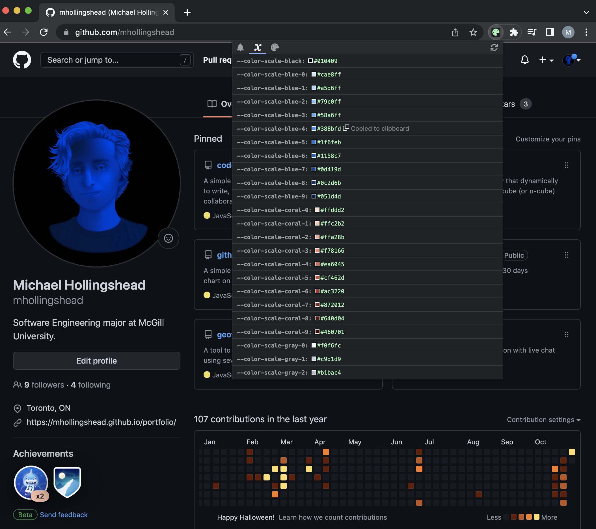
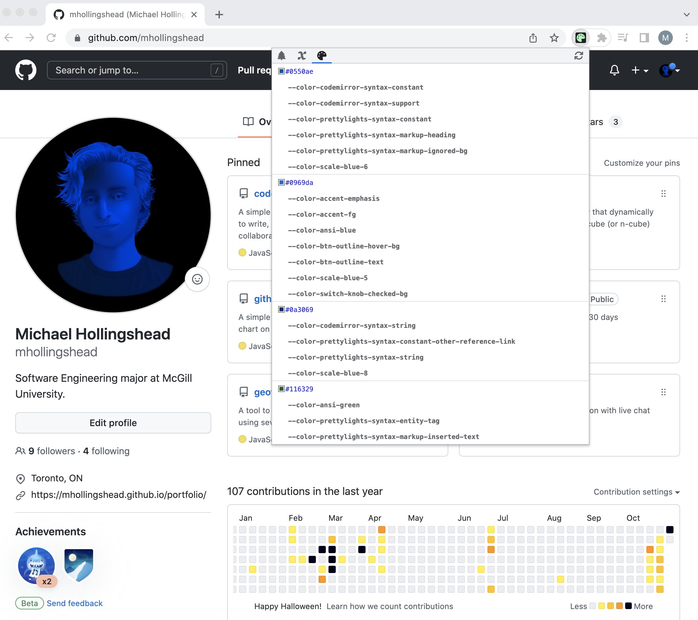

<h1 align="center">Theme Explorer</h1>

*A simple Chrome Extension that allows users to explore any webpage's theme styles.*


Many websites use [CSS custom properties](https://developer.mozilla.org/en-US/docs/Web/CSS/Using_CSS_custom_properties) (or *variables*) to store theme styles that persist throughout the entire site. The extension grabs any CSS variables defined on the current page's `:root` and `body` and organizes them into several "views" to be explored by the user.

### Tech Stack

*  JavaScript
*  HTML
*  CSS
* [Prism.js](https://prismjs.com/)
* [TinyColor](https://github.com/bgrins/TinyColor)

## Installation

* Download the `10-theme-explorer` directory.
* In Google Chrome, navigate to the [Chrome extension manager](chrome://extensions/) (`chrome://extensions/`).
* Make sure that **Developer mode** is switched **on**.
* Drag the `10-theme-explorer` directory anywhere onto the page to install.

If successful,  **Theme Explorer** should appear in your extensions list.

## Usage

Any time the extension popup is opened, it will check the current page for any theme variables. If at any point you want to refetch the theme variables (i.e. if the theme has changed), you can click the refresh button in the top right (or, alternatively, you can close or reopen the popup).

Any found theme variables will be listed in 3 different views: **Keyword tree**, **Variable list**, and **Styles list**.

### Keyword Tree

The 'Keyword tree' view (indicated by the tree icon) splits variable names into keywords and generates a traversable keyword tree.

For example, if a page contains the following variables:

```css
--color-text-primary: #000;
--color-text-secondary: #444;
```

they will be converted to the following keyword tree:

```json
{
    color: {
        text: {
            primary: "#000",
            secondary: "#444"
        }
    }
}
```

This is done for property names formatted in `kebab-case`, `snake_case`, and `camelCase`. So

```css
--color_text_primary: #000;
--colorTextSecondary: #444;
```

will generate the same keyword tree as above.

### Variable List

The 'Variable list' view (indicated by the x icon) lists each unique custom property name and their style values.



### Styles List

The 'Styles list` view (indicated by the palette icon) lists each unique style value and the custom properties whose values are equal to that value.

