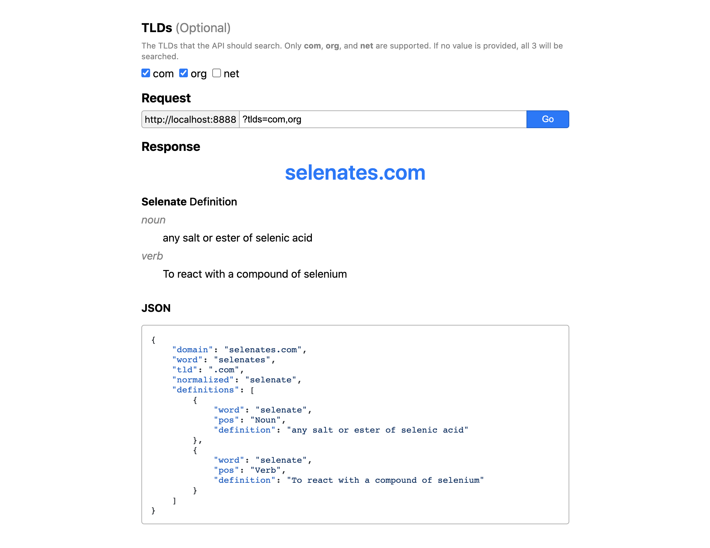

<h1 align="center">Random Dictionary Domain API</h1>

*A simple REST API that attempts to find a random dictionary domain available for purchase.*



### [Try it out here!](https://mhollingshead.github.io/30-days-30-projects/13-random-dictionary-domain/demo)

### Tech Stack

*  Node.js
*  Express.js
* [Axios](https://axios-http.com/)
* [compromise](https://compromise.cool/)

## Install and Run

1. Download and navigate to the `/13-random-dictionary-domain` directory.
2. Run `npm i` to install the necessary dependencies.
3. Rename `.env.sample` to `.env` and set `PORT` to the port you'd like the server to listen for requests on. *If no `PORT` is provided, port `8888` will be used.*
4. Run `npm start` to start listening for requests on `http://localhost:<PORT>`.

## Usage

All requests should be **GET** requests, and request URLs should be built like so:

```
http://localhost:<PORT>
```

or

```
http://localhost:<PORT>?tlds=<TLDS>
```

where

* `<PORT>` is the port the server is listening on *(`8888` by default)*
* `<TLDS>` is a comma separated list of TLDs (or Top Level Domains) to search.
    * For example, `tlds=com` will only search for **.com** dictionary domains.
    * Only `com`, `org`, and `net` are valid TLDs.
    * If no `tlds` query parameter is provided, a default value of `tlds=com,org,net` will be used.

## Example Requests

The simplest request URL would be:

### **GET** `/`:

```
http://localhost:8888
```

which would respond with a dictionary domain that is available under the **.com**, **.org**, or **.net** domains.

If you wanted to limit the search to only **.com** and **.org** domains, you would use the following request URL:

### **GET** `/`:

```
http://localhost:8888?tlds=com,org
```

which would respond with a dictionary domain that is available under the **.com** or **.org** domains.

The TLD order corresponds to the priority with which domains will be searched. In the example above, `.com` domains will be checked first, then `.org`.

## Example Response

```json
{
    "domain": "examples.com",
    "word": "examples",
    "tld": ".com",
    "normalized": "example",
    "definitions": [
        {
            "word": "example",
            "pos": "Noun",
            "definition": "Something that is representative of all such things in a group."
        },
        {
            "word": "example",
            "pos": "Verb",
            "definition": "To be illustrated or exemplified (by)."
        }
    ]
}
```

### Response Structure

| Attribute | Type | Description |
| --- | --- | --- |
| res.**`domain`** | `String` | The available dictionary domain |
| res.**`word`** | `String` | The dictionary word used to find the domain |
| res.**`tld`** | `String` | The TLD. `".com"`, `".org"`, or `".net"`. |
| res.**`normalized`** | `String` | The 'normalized' from of the dictionary word. Nouns are made singular and verbs are made infinitive. Used to obtain definitions. |
| res.**`definitions`** | `Array<Object>` | An array of definition objects, which contain the `word`, the `pos` (part of speech), and the `definition`. |

### Errors

This API relies on several other APIs and services, specifically:

* [Random Word API](https://random-word-api.herokuapp.com/home), for obtaining random dictionary words,
* [RDAP.org](https://about.rdap.org/), which provides a bootstrap server for querying RDAP servers, and
* [Wiktionary API](https://www.mediawiki.org/wiki/Toolserver:Unified_Wiktionary_API), which supplies definitions.

As such, there are several stages where errors may occur. An error response will have a **non-200** status. For possible error statuses and their messages, refer to the table below:

| Status | Message | Reason |
| --- | --- | --- |
| `400` | `Invalid Request: No valid TLDs were provided. The tld param accepts one or multiple of com`\|`org`\|`net in a comma-separated list.` | This error should only occur if the `tlds` query parameter is set and contains no valid TLDs. |
| `404` | `No Domain Found: No available domain was found in this batch. Each request searches a maximum of 60 domains before aborting.` | The API generates a batch of 60 unique domains to check. If none of the domains in the batch are available, the server will respond with a `404` error. This limit is put in place to avoid going over RDAP rate limits and burdening their servers. |
| `429` | `Unable to Continue: The rate limit of an RDAP endpoint was exceeded. Please try again later. (See https://about.rdap.org/ for more details)` | RDAP.org (and all RDAP servers) have a rate limit. If too may successive requests are made to a server in a short amount of time, the server may temporarily block access to your IP. In order to respect these rate limits and avoid burdening the servers, the API will only attempt to access domain information 2 times per second, and will abort immediately if a rate limit was exceeded or an available domain was found. However, there is always a possibility that the rate limit will be triggered, whether by many simultaneous requests or the unlikely event that the API is unable to locate an available domain. **Be cautious and curteous of the RDAP rate limits when using this API**. |
| `500` | `Server Error: An unexpected error occurred. Please try again later.` | This error indicates some other non-rate-limit-related error during the search process. It will most likely result from an RDAP server being temporarily down or an issue with the Random Word API. |

## Sample Implementation

```javascript
fetch('https://localhost:8888?tlds=com,org')
    .then(res => res.json())
    .then(data => console.log(data))
    .catch(e => console.log(e));

/*
    {
        "domain": "selenates.com",
        "word": "selenates",
        "tld": ".com",
        "normalized": "selenate",
        "definitions": [
            {
                "word": "selenate",
                "pos": "Noun",
                "definition": "any salt or ester of selenic acid"
            },
            {
                "word": "selenate",
                "pos": "Verb",
                "definition": "To react with a compound of selenium"
            }
        ]
    }
/*
```