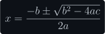

<h1 align="center">GitHub LaTeX API</h1>

A simple API that allows you to embed inline LaTeX expressions like , or display expressions like

<p align="center">
    
</p>

into GitHub READMEs, or any GitHub flavored markdown.

## Install and Run

1. Download and navigate to the `/15-github-readme-latex` directory.
2. Run `npm i` to install the necessary dependencies.
3. Rename `.env.sample` to `.env` and set `PORT` to the port you'd like the server to listen for requests on. *If no `PORT` is provided, port `8080` will be used.*
4. Run `npm start` to start listening for requests on `http://localhost:<PORT>`.

## Usage

The API 'wraps' the [CodeCogs LaTeX engine](https://editor.codecogs.com/docs/) in order to add additional formatting for use in GitHub READMEs.

### Requests

A simple request might look something like this:

```
http://localhost:8080/?latex=E=mc^2
```

**`latex`** is the only required query parameter: the LaTeX expression that you would like to render. If necessary, you can [encode](https://developer.mozilla.org/en-US/docs/Web/JavaScript/Reference/Global_Objects/encodeURIComponent) the LaTeX string to escape any problematic characters that may be present in the equation.

The API will respond with an SVG image of the LaTeX expression, formatted for use in GitHub READMEs.

### Embedding LaTeX in a README

To embed a LaTeX expression in [GitHub Flavored Markdown](https://github.github.com/gfm/), simply use an `img` element and set the `src` to the request url:

**Markdown:**

```markdown
Einstein's famous formula  describes the relationship between mass and energy.
```

**Result:**

Einstein's famous formula  describes the relationship between mass and energy.

> **NOTE**: By default, equations are assumed to be `inline`. When embedding inline equations, make sure to add `align="middle"` so the equation properly aligns with the text around it.

### Options

The API provides several options for customization:

| Option | Type | Default | Description |
| --- | --- | --- | --- |
| `latex` (required) | `String` | `undefined` | A valid LaTeX expression to be rendered as an SVG. |
| `display` | `Boolean` | `false` | If `true`, the expression will be rendered as a display equation rather than an inline equation. For differences between `display` and `inline`, see the [equations](#equations) section. |
| `theme` | `String` | `default-light` | The GitHub theme that should be used to style the equation. At the moment, `default-light`, `default-dark`, `dark-dimmed`, and `dark-high-contrast` are currently supported. For examples, see the [themes](#themes) section. |
| `background` | `Boolean` | `false` | If `true`, the expression will be rendered with a background (specified by the `theme`). This is useful if you'd like to ensure the expression is visible regardless of the reader's theme (without using GitHub's `#gh-dark-mode-only` / `#gh-light-mode-only` theme contexts).

## Equations

The API allows you to render two different types of equations: **`inline`** and **`display`**. Equations are rendered as `inline` by default. To render the equation as `display`, add the query param `&display=true` to the request url.

### Inline

This is an example of an inline equation: .

Inline equations are meant to appear in the middle of the main text and are usually 'minimized' to fit with the natural flow of a paragraph.

**In order to properly align an inline equation with a body of text, make sure that the `img` element's `align` property is set to `middle`.** For example:

```markdown

```

This is necessary because the API will automatically add vertical padding to make sure that both the markdown and equation baselines line up.

In this way, bottom-heavy equations like  and top-heavy equations like  are both properly aligned.

### Display

This is an example of a display equation:

<p align="center">
    
</p>

Display equations are usually separate from the main text and aren't 'minimized' in the same way inline equations are. For comparison, here's the same equation inline: .

To center the equation and add proper margins, you can wrap the `` tag in `<p align="center">` tags (or `<center><p>` tags). For example:

```markdown
<p align="center">
    
</p>
```

Notice that display equations don't require the `img`'s `align` property to be set to `middle`. Because display equations are meant to be kept separate from the main text, there is no baseline to align them to, so no vertical padding is added.

## Themes

Refer to the table below to see examples of each supported theme:

| Theme | `&background=true` | `&background=false` |
| --- | --- | --- |
| `default-light` |  |  |
| `default-dark` |  |  |
| `dark-dimmed` |  |  |
| `dark-high-contrast` |  |  |

### Rendering based on user's current theme

As of [late 2021](https://github.blog/changelog/2021-11-24-specify-theme-context-for-images-in-markdown/), GitHub allows users to conditionally include images in READMEs based on the user's current theme.

To do this, simply append `#gh-dark-mode-only` or `#gh-light-mode-only` to the end of an image url. Images tagged with `#gh-dark-mode-only` will only display if the user has a dark theme enabled, while `#gh-light-mode-only` will only display if the user has a light theme enabled.

For example:

```markdown


```

should render a `default-light`-themed equation if the user has a light theme enabled and a `default-dark`-themed equation if the user has a dark theme enabled.

The following equation should be displayed according to your current GitHub theme:

<p align="center">
    
    
</p>