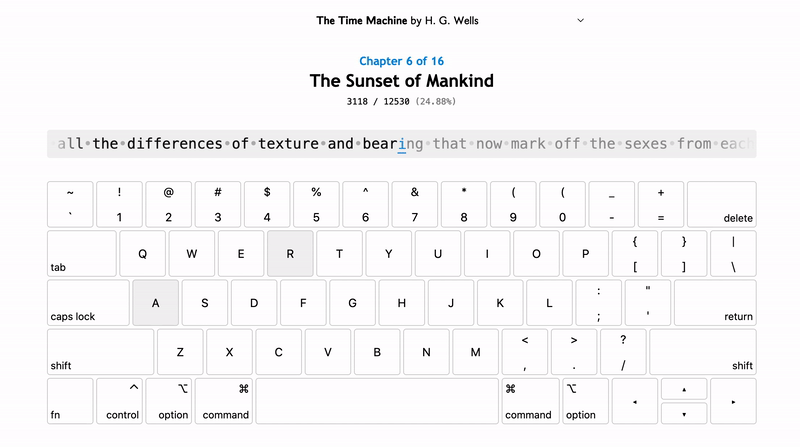

<h1 align="center">Type a Book</h1>

*An app that allows users to practice typing while reading a classic novel.*



### [Try it out here!](https://mhollingshead.github.io/30-days-30-projects/16-type-a-book/build/)

### Tech Stack

*  JavaScript
*  Vue.js
*  CSS

## Install and Run

1. Download / navigate to the `/16-type-a-book` directory.
2. Run `npm install` to install the necessary dependencies.
3. Run `npm run serve`.

By default, the app should be accessible at [http://localhost:8080](http://localhost:8080).

## Implementation

This app started as a simple typing visualization, but as I was looking for bodies of text for the user to type I had the idea of using entire novels start to finish. In testing, I found that *typing* your way through a novel provides a really new and interesting way to experience a book.

Currently there are 7 classics available on the site:

* **Alice's Adventures in Wonderland** by Lewis Carroll,
* **The Call of the Wild** by Jack London,
* **The Great Gatsby** by F. Scott Fitzgerald,
* **Heart's Kindred** by Zona Gale,
* **Jane Eyre** by Charlotte Brönte,
* **The Strange Case of Dr. Jekyll and Mr. Hyde** by Robert Louis Stevenson, and
* **The Time Machine** by H. G. Wells

Each book is in the public domain, and each one's text content was taken from [Project Gutenberg](https://www.gutenberg.org/).

All characters were normalized for ease of typing, i.e. opening and closing quotations / apostrophes were converted to `"` / `'`, diacritics like `è` and `æ` were converted to base characters `e` or `ae`, and extended dashes were converted to `-`.

For each book, we keep track of the user's `chapter` and `character` positions in `localStorage` so their progress is saved between sessions. We display `previous`, `current` and `next` characters using these indices and a `chars` array (the array of characters in the current chapter) via the `setChars` method:

```javascript
setChars() {
    // Set the chars to the left of the current char
    this.text.previous = this.chars.slice(
        Math.max(this.position.char - BUFFER, 0), 
        this.position.char
    );
    // Set the current char
    this.text.current = this.chars[this.position.char] === '\n' ? 'Enter' : this.chars[this.position.char];
    // Set the chars to the right of the current char
    this.text.next = this.chars.slice(
        this.position.char + 1, 
        Math.min(this.position.char + 1 + BUFFER, this.chars.length
    );
}
```

When the `Keyboard` component mounts, we add `keydown` and `keyup` listeners to both highlight the currently active key on the keyboard, and check if `e.key` is equal to the current character, in which case we move on to the next character:

```javascript
mounted() {
    window.addEventListener('keydown', e => {
        if (e.key === this.current) {
            this.$emit('handleCorrectInput');
        } else if (e.key.length === 1 || e.key === 'Enter') {
            this.$emit('handleIncorrectInput', e.key);
        }
        const key = this.getKey(e.code);
        key.active = true;
    });
    window.addEventListener('keyup', e => {
        const key = this.getKey(e.code);
        key.active = false;
    });
}
```

The `getKey` method simply gets the necessary key from the `keyboard` array in state. The keyboard is represented by a nested array of keyboard rows and the keys in each row.

`key`s where `active === true` are highlighted on the keyboard. If the `key` is not the current key, a `state` value is set to `-1`, which renders the current character / the currently active keys red (to indicate an incorrect input).

The other methods are fairly standard and simply change the current book or handle correct/incorrect inputs accordingly.