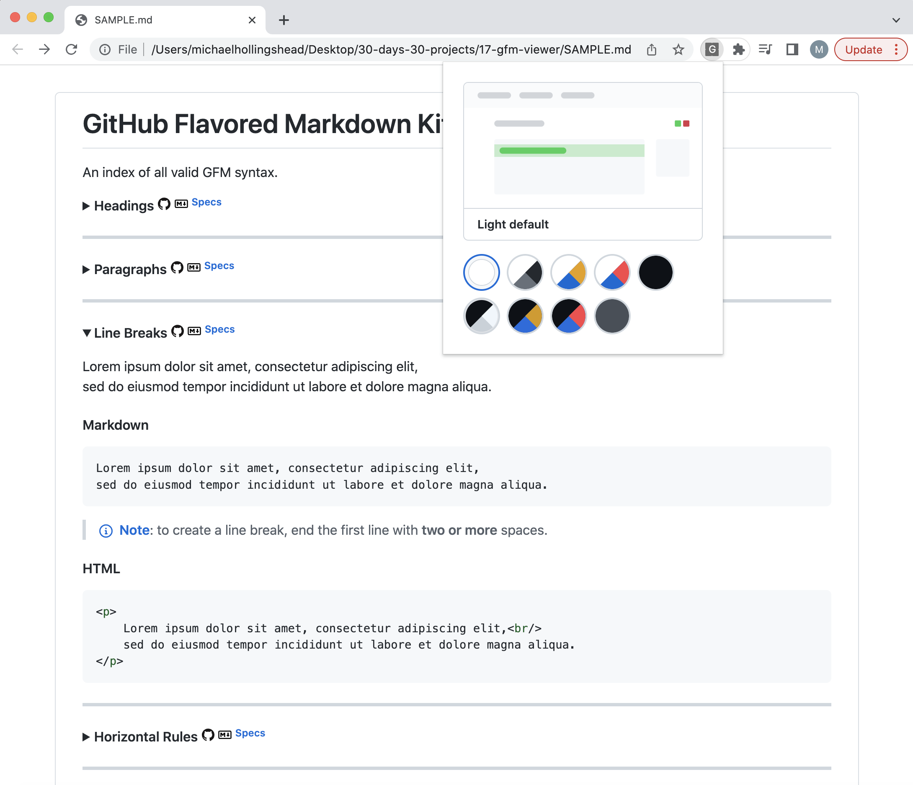

<h1 align="center">GFM Viewer</h1>

*A simple Chrome Extension that auto-renders raw `*.md` files to GitHub-styled HTML.*

The extension aims to render GitHub flavored markdown as similarly to GitHub's markdown rendering engine as possible in order to accurately visualize how the markdown will render on GitHub.

### Tech Stack

*  JavaScript
*  HTML
*  CSS
* [Showdown](https://github.com/showdownjs/showdown)
* [starry-night](https://github.com/wooorm/starry-night)
* [MathJax](https://www.mathjax.org/)

## Installation

* Download the `17-gfm-viewer` directory.
* In Google Chrome, navigate to the [Chrome extension manager](chrome://extensions/) (`chrome://extensions/`).
* Make sure that **Developer mode** is switched **on**.
* Drag the `17-gfm-viewer` directory anywhere onto the page to install.

If successful, **GFM Viewer** should appear in your extensions list.

## Usage

The extension listens to active tabs for any path matching `file://*/*.md`, i.e. it will run on any local `.md` file open in chrome. Then, it will render an HTML document like so:

1. The raw markdown is taken from the document and converted to GitHub-flavored HTML using [Showdown](https://github.com/showdownjs/showdown).
2. A GitHub theme is applied to the document.
3. Additional postprocessing occurs:
    1. Any code blocks are automatically syntax highlighted using [starry-night](https://github.com/wooorm/starry-night).
    2. Other GitHub-specific components are inserted (i.e. Note / Warning blocks).
    3. LaTeX equations are rendered using [MathJax](https://www.mathjax.org/).

As a result, the rendered document will appear nearly identical to the GitHub's rendering.

### Popup

In the extension popup, you can switch the page's theme to any of GitHub's currently offered themes:

* Light default
* Light high contrast
* Light Protanopia & Deuteranopia
* Light Tritanopia
* Dark default
* Dark high contrast
* Dark Protanopia & Deuteranopia
* Dark Tritanopia
* Dark dimmed

Your theme preferences will persist across sessions using `localStorage`.