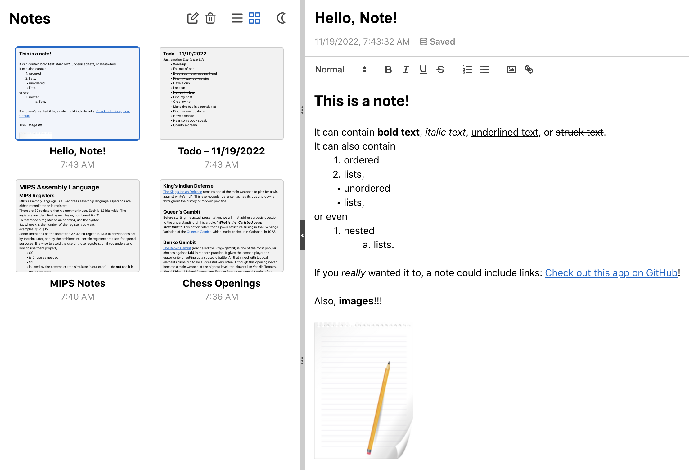
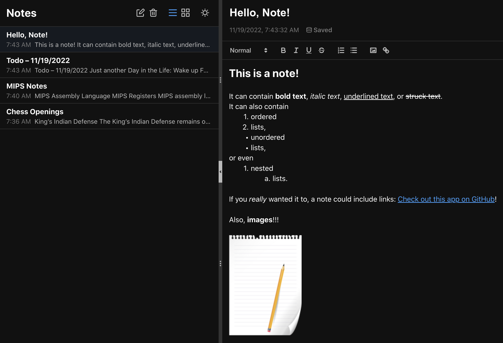

<h1 align="center">Notes App</h1>

*A React / Redux notes app loosely based on Apple's Notes app.*



### [Try it out here!](https://mhollingshead.github.io/30-days-30-projects/18-notes-app/build/)

### Tech Stack

*  JavaScript
*  React
*  Redux
*  Sass
* [Quill](https://quilljs.com/)

## Install and Run

1. Download / navigate to the `/8-notes-app` directory.
2. Run `npm i` to install the necessary dependencies.
3. Run `npm start`. 

A new browser window should open to [http://localhost:3000](http://localhost:3000), where you should be able to start using the app.

## Implementation

This app is state-heavy, and has many components that need to render based on note state with each edit. For that reason, I decided to use Redux (particularly `react-redux`) to handle state-management.

Our `notesSlice` keeps track of `all` notes as well as the `active` note. We have 4 simple reducers that make changes to our note state: `addNote`, `removeNote`, `updateNote`, and `setActiveNote`. Our `active` note state usually changes as a side-effect of `all` note state changes (with the exception of `setActiveNote`).

Users' notes are saved in `localStorage` in order to persist between sessions, so our initial state simply loads the `notes` value from `localStorage`. If none exists, we initialize a `notes` array with an empty note inside.

`note` objects have the following attributes:

* `id`, a unique id (the timestamp the note was created),
* `title`, the title of the note (by default `"Untitled Note <n>"`),
* `contents`, a quill.js `Delta` object that's used to set the quill editor contents,
* `text`, the text content of the note,
* `html`, the HTML markup of the note, and
* `lastEdit`, a timestamp that represents the date and time of the last edit.

Depending on the view selected by the user, all notes will be displayed as either a **preview** (the `NotePreview` component), which uses the `note.html` value to render a preview of the note, or a **summary** (the `NoteSummary` component), which uses the `note.text` value to present a brief summary of the note's content.

In our `Note` component (which allows the user to edit the `title` or `contents` of the active note) we update our state using `updateNote` whenever the user makes an edit.

We listen for `user` input in the editor using quill's `on text-change` listener, and handle accordingly:

```javascript
quill.on('text-change', (_, __, source) => {
    if (source === 'user') {
        handleContentsChange(quill.getContents(), quill.getText(), quill.root.outerHTML)
    }
});
```

In `handleContentsChange` we add the new data to the `active` note state and `dispatch` our `updateNote` reducer:

```javascript
const handleContentsChange = (contents, text, html) => {
    const activeNoteState = store.getState().notes.active;
    dispatch(updateNote({
        ...activeNoteState,
        lastEdit: timestamp(),
        contents: { ...contents },
        text: text,
        html: html
    }));
    if (autosaveTimeout) clearTimeout(autosaveTimeout);
    autosaveTimeout = setTimeout(storeNotes, 1000);
};
```

`storeNotes` saves `all` notes state to `localStorage`. We don't want to save changes to `localStorage` on every editor change, so we initialize a `autosaveTimeout` variable. When an editor change is detected, we clear any existing `autosaveTimeout` and set a new one with a  `1000`ms delay. This way, our updated `notes` are only saved to `localStorage` after a full second with no edits.

We also listen for changes to the note title. We listen for an `onblur` event on the title input and handle accordingly:

```javascript
const handleTitleBlur = (e) => {
    const activeNoteState = store.getState().notes.active;
    const newTitle = e.target.value.trim() || activeNoteState.title;
    dispatch(updateNote({
        ...activeNoteState,
        lastEdit: timestamp(),
        title: newTitle
    }));
    storeNotes();
};
```

Since we only listen for the user un-focusing the input, `handleTitleBlur` will only be called after the final title has been set, so we can save the updates notes to `localStorage` right away.

Most other components are fairly straightforward. We have a `LayoutController` which allows the user to adjust the `Sidebar` component's width or collapse the `Sidebar` component entirely. `SidebarHead` dispatches `addNote` and `removeNote`, and also switches layout views and themes (which are handles by react state).

Here's a sample of the **list** view with **dark** theme enabled:



