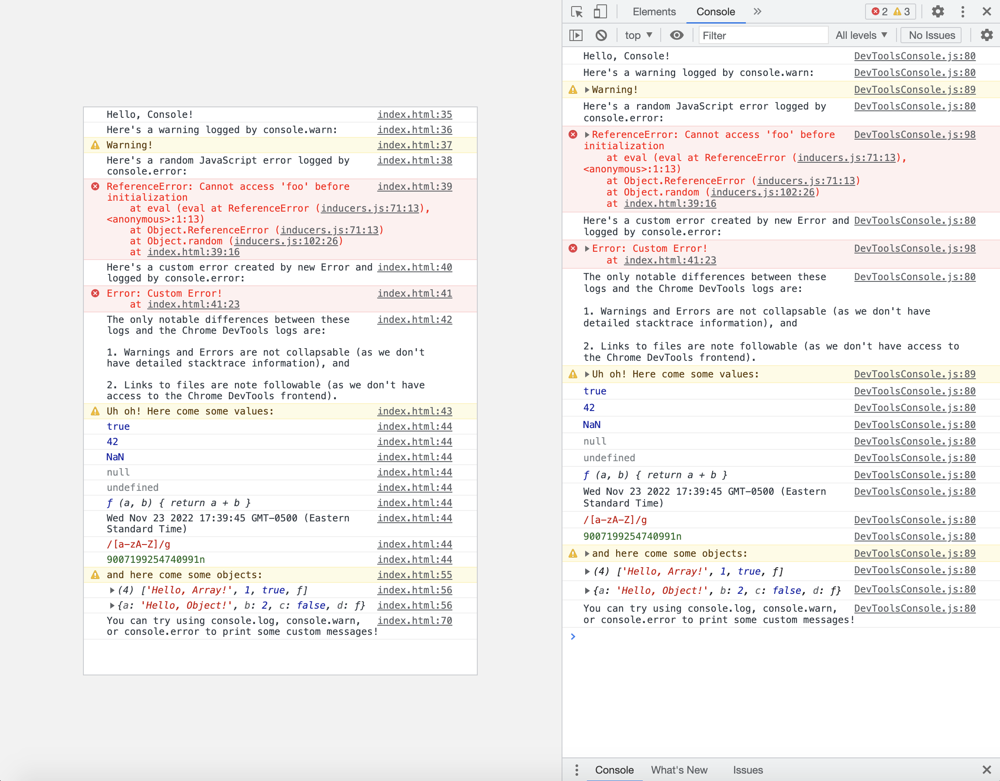

<h1 align="center">DevToolsConsole.js</h1>

*A JavaScript library that embeds a Chrome DevTools console on a webpage.*



### [Try it out here!](https://mhollingshead.github.io/30-days-30-projects/19-devtools-console/)

### Tech Stack

*  JavaScript
*  CSS

### Installation

In the `body` of your document, include DevToolsConsole.js in a script tag:

```html
<script src="path/to/DevToolsConsole/DevToolsConsole.js"></script>
```

In the `head` of your document, include the default stylesheet DevToolsConsole.css:

```html
<link rel="stylesheet" href="path/to/DevToolsConsole/DevToolsConsole.css" />
```

### Usage

You can initialize a new `DevToolsConsole` like so:

```html
<div id="container"></div>
<script>
    const options = {
        log: true,
        warn: true,
        error: true,
        theme: 'light'
    }

    const myConsole = new DevToolsConsole('#container', options);

    console.log('Hello, Console!');
</script>
```

The library will wrap the browser's `console.log`, `console.warn`, and `console.error` methods in order to print messages to both `myConsole` and the browser's console.

### Options

The following options are available:

| Option | Type | Default | Description |
| --- | --- | --- | --- |
| options.`log` | `boolean` | `true` | Indicates whether or not `console.log` messages should be printed. |
| options.`warn` | `boolean` | `true` | Indicates whether or not `console.warn` messages should be printed. |
| options.`error` | `boolean` | `true` | Indicates whether or not `console.error` messages should be printed. |
| options.`theme` | `string` | `light` | Indicates the console's theme. `light` and `dark` are accepted. |

### Styling

If you'd like to add custom styling, here are the necessary selectors:

| Selector | Description |
| --- | --- |
| `.DevToolsConsole` | The console wrapper |
| `.DevToolsConsole .message` | A console message, i.e. a `log`, `warning`, or `error` |
| `.DevToolsConsole .gutter` | A console message's left gutter. Contains the `warning` or `error` icons |
| `.DevToolsConsole .content` | The message's content |
| `.DevToolsConsole .caller` | The message's caller |
| `.DevToolsConsole .text` | The message's text content of a message |
| `.DevToolsConsole .call` | A call in an error's call stack |
| `.DevToolsConsole .log` | A `console.log` message |
| `.DevToolsConsole .warn` | A `console.warn` message |
| `.DevToolsConsole .error` | A `console.error` message |
| `.DevToolsConsole .parameter-null` | A `null` parameter |
| `.DevToolsConsole .parameter-undefined` | An `undefined` parameter |
| `.DevToolsConsole .parameter-number` | A `number` parameter |
| `.DevToolsConsole .parameter-boolean` | A `boolean` parameter |
| `.DevToolsConsole .parameter-string` | A `string` parameter |
| `.DevToolsConsole .parameter-regexp` | A `RegExp` parameter |
| `.DevToolsConsole .parameter-bigint` | A `BigInt` parameter |
| `.DevToolsConsole .parameter-object` | An `Object` parameter |
| `.DevToolsConsole .parameter-function` | A `function` parameter |
| `.DevToolsConsole .keyword-function` | A `function` parameter's `ƒ` keyword |
| `.DevToolsConsole .preview` | An `Object` preview |
| `.DevToolsConsole .object-key` | An `Object` preview's key |

