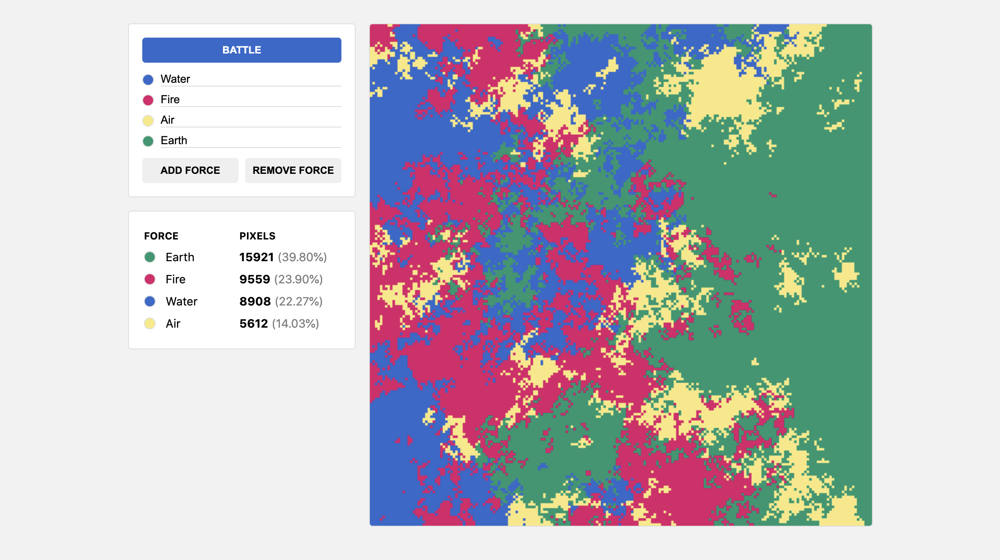

<h1 align="center">Pixel Battle</h1>

*A pixel battle simulation where up to 8 colors (or "forces") fight to control a 200 by 200 pixel grid until one is left standing.*



### [Try it out here!](https://mhollingshead.github.io/30-days-30-projects/4-pixel-battle/)

### Tech Stack

*  JavaScript
*  HTML
*  CSS

### Implementation

The concept of this simulation is based on [pixelsfighting.com](https://pixelsfighting.com/). Because Pixels Fighting only uses two colors, it's able to utilize binary operations to determine which color controls what pixel. Our simulation can have up to 8 different "forces" battling for one pixel at a time, therefore our scripts will be very different.

The main component of this webapp is the "battlefield", or the grid that represents each pixel on the board. The board itself is a `canvas` element, which is partitioned into different colors, or *forces*, and populated by each force's color.

We start with our simulation options and state. These can be customized by the user:

```javascript
const options = {
    width: 200,
    forces: 2
}

const state = {
    // Default force colors and names. These can be customized by the user
    colors: ["#3366cc","#dc3912","#ff9900","#109618","#990099","#0099c6","#dd4477","#66aa00"],
    names: ["Force 1", "Force 2", "Force 3", "Force 4", "Force 5", "Force 6", "Force 7", "Force 8"]
};

```

We initialize the board by dynamically filling the grid with each force's colors. We also keep track of the number of pixels each force controls throughout the simulation. This helps us with both displaying stats as well as checking for a winner after each frame. Because we're using a canvas to render the board, we just need to loop through the board array and draw each pixel accordingly:

```javascript
const drawBoard = () => {
    // Draws each pixel on the canvas
    for (let i = 0; i < options.width; i++) {
        for (let j = 0; j < options.width; j++) {
            state.context.fillStyle = state.colors[state.board[i][j]];
            // Pixels are 3px by 3px
            state.context.fillRect(i*3, j*3, 6, 6);
        }
    }
}

const initBoard = () => {
    const canvas = document.querySelector('.battlefield');
    // The app only works in browsers where canvas is supported
    if (canvas.getContext) {
        state.context = canvas.getContext('2d');
        // The board is represented as a 2-dimensional array
        state.board = Array.from(Array(options.width), () => new Array(options.width));
        // We also keep track of the count of each force's pixel count
        state.counts = new Array(options.forces).fill(0);
    }
    // Initially, we divide the canvas vertically and fill each section with a force
    for (let i = 0; i < options.width; i++) {
        for (let j = 0; j < options.width; j++) {
            // Determine which force we're currently working with
            const force = Math.floor(i / (options.width / options.forces));
            // Update the board and the current force's pixel count
            state.board[i][j] = force;
            state.counts[force]++;
        }
    }
    // Once the board is initialized, draw the board
    drawBoard();
}
```

Forces have several components (color, name, pixel count, etc.), so we keep track of each component in an array and store forces as indices that are used to index each array. The user can edit force names/colors and add/remove forces. These functions are fairly standard and simply update the relevant state variables, then re-initialize the board.

Once the battle has commenced, we set an interval which acts as our simulation loop. Each frame of the simulation, we update the game board by looping through each pixel and determining which force will control that pixel this frame. To do this, we need to check the forces that control the surrounding pixels:

```javascript
// Count the number of surrounding pixels that are controlled by each force
const getSurroundingPixels = (x, y) => {
    // Initialize an empty array representing the count of each field
    const surroundingPixels = new Array(options.forces).fill(0);
    let totalSurroundingPixels = 0;
    // Check each surrounding pixel
    for (i = x - 1; i <= x + 1; i++) {
        for (j = y - 1; j <= y + 1; j++) {
            // If the pixel is not invalid, and not the pixel we're checking for,
            if (i >= 0 && i < options.width && j >= 0 && j < options.width && !(i === x && j === y)) {
                // Increase the count of the force that controls the current pixel
                surroundingPixels[state.board[i][j]]++;
                // Increase the total number of valid surrounding pixels
                totalSurroundingPixels++;
            }
        }
    }
    // Return the array of surrounding force counts as well as the total number of surrounding pixels
    return { surrounding: surroundingPixels, total: totalSurroundingPixels };
}
```

Given some pixel at coordinates `(x, y)`, we check every pixel that surrounds it. We initialize an array that represents each force and fill it with `0`s. This array is used to keep track of how many surrounding pixels are controlled by each force. We also keep track of how many surrounding pixels are valid, so that we can determine the percent controlled by each force. These values are used to determine which force will control the pixel in question.

> For example, assume we have 2 forces and we want to determine which force will control the top-left-most pixel. The top-left pixel is surrounded by 3 pixels. Assume 2 pixels are controlled by force 0 and 1 pixel is controlled by force 1, i.e. `surroundingPixels = [2, 1]`. Then the top-left-most pixel will have a `2/3=0.66` chance of being controlled by force 0 and a `1/3=0.33` chance of being controlled by force 1.

For every pixel on the board, we use the calculations above to determine which force controlls what pixel:

```javascript
const updateBoard = () => {
    // Loop through each pixel on the board
    for (let i = 0; i < options.width; i++) {
        for (let j = 0; j < options.width; j++) {
            // Get the count of surrounding pixels controlled by each force, plus the total
            // number of valid surrounding pixels
            const { surrounding, total } = getSurroundingPixels(i, j);
            // Generate a random number between 0 and 1 representing the outcome of the "fight" 
            // for the current pixel
            const outcome = Math.random();
            // Loop through each force
            for (let k = 0; k < surrounding.length; k++) {
                // Calculate the odds of the current pixel [i][j] being controlled by the 
                // current force [k]. This is equal to the sum of all surrounding forces 0..k 
                // divided by the total number of surrounding pixels
                const outcomeOdds = surrounding.slice(0, k + 1).reduce(sumReducer, 0) / total;
                // If our random outcome falls within these odds, the current force will 
                // control the current pixel.
                if (outcome < outcomeOdds) {
                    // Remove one from the original force's count
                    state.counts[state.board[i][j]]--;
                    // Set the pixel to the resulting force
                    state.board[i][j] = k;
                    // Add one to the resulting force count
                    state.counts[k]++;
                    // No need to continue, the result has been determined
                    break;
                }
            }
        }
    }
    // Once the board is updated, draw the updated board
    drawBoard();
}
```

We generate a random number to represent the outcome for each pixel. Using our surrounding pixel counts, we generate ranges that represent the odds of each force controlling the current pixel. Whichever range our random number outcome falls between determines which force the current pixel will be controlled by.

> For example, assume we have 4 forces on the board: `0`, `1`, `2`, and `3`. Given some pixel, we want to determine which force will control it. Assume that pixel is surrounded by 8 pixels, and the `surroundingPixel` count for each force is `[4, 1, 2, 1]`. This gives the ranges **0 to 0.5** for force `0`, **0.5 to 0.625** for force `1`, **0.625 to 0.875** for force `2`, and **0.875 to 1** for force `3`. If our random outcome is 0.2, then the pixel will be controlled by force `0`.

We do this calculation for each pixel on the board and continue until the entire board is controlled by one force. To do this, we simply check for a winner after each frame of the simulation:

```javascript
const checkWinner = () => {
    // If there is a force that controls all 40,000 of the pixels, they are our winner
    return state.counts.indexOf(state.counts.find(count => count === 40000));
}
```

Recall that we're keeping track of how many pixels each force is controlling. At any given time, if a force controlls all 40,000 pixels, then they are the winner and the simulation is over.