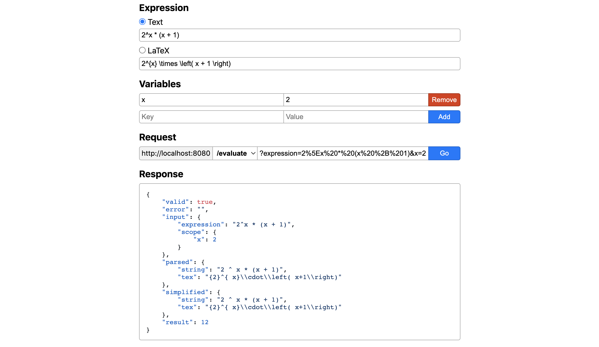

<h1 align="center">Equation Solver API</h1>

*A REST API used to parse, simplify, and evaluate mathematical expressions.*



### [Try it out here!](https://mhollingshead.github.io/30-days-30-projects/5-equation-solver/demo)

### Tech Stack

*  Node.js
*  Express.js
* [math.js](https://mathjs.org/)

### Install and Run

1. Download and navigate to the `/5-equation-solver` directory.
2. Run `npm i` to install the necessary dependencies.
3. Rename `.env.sample` to `.env` and set `PORT` to the port you'd like the server to listen for requests on. *If no `PORT` is provided, port `8080` will be used.*
4. Run `npm start` to start listening for requests on `http://localhost:<PORT>`.

### Usage

The API has 3 endpoints:

* [parse](#parse),
* [simplify](#simplify), and
* [evaluate](#evaluate).

Each endpoint represents a step in the expression evaluation process, so each endpoint will build on the previous.

> I.e., `parse` will return the parsed expression, `simplify` will return the parsed expression *and* the simplified expression, and `evaluate` will return the parsed expression, simplified expression, *and* the result.

In general, all requests should be **GET** requests, and request URLs should be built like so:

```
http://localhost:<PORT>/<ENDPOINT>?expression=<EXPRESSION>&<VAR1>=<VAL1>&<VAR2>=<VAL2>&...
```

where

* `<PORT>` is the port the server is listening on *(`8080` by default)*
* `<ENDPOINT>` is one of three endpoints: `parse`, `simplify`, or `evaluate`
* `<EXPRESSION>` is a **URI-encoded** mathematical expression
  * Expressions can be either **plain text** or **LaTeX** expressions
* `<VAR>=<VAL>` are **variable definitions**, or key value pairs representing the scope of the expression
  * The scope is only used within the `evaluate` endpoint

#### Example Request

For example, say we want to `evaluate` the expression `x*y` where `x=2` and `y=3`. We would send a **GET** request to:

```
http://localhost:8080/evaluate?expression=x*y&x=2*y=3
```

or, using LaTeX:

```
http://localhost:8080/evaluate?expression=x%20%5Ctimes%20y&x=2&y=3
```

### Endpoints

### `/parse`

Returns the parsed expression as `string` or `tex`.

#### Sample Request URL

```
http://localhost:8080/parse?expression=x*x
```

#### Sample Request

```javascript
fetch('http://localhost:8080/parse?expression=x*x')
    .then(res => res.json())
    .then(data => {
        console.log(data);
    });
```

#### Sample Response

All responses are JSON objects with the following data:

```json
{
    "valid": true,
    "error": "",
    "input": {
        "expression": "x*x",
        "scope": {}
    },
    "parsed": {
        "string": "x * x",
        "tex": " x\\cdot x"
    }
}
```

#### Errors

* `"Request Error: No expression provided"`
  * No `expression` was provided in the query
* `"Parsing Error: Invalid expression"`
  * math.js was unable to parse the expression, or the expression provided was invalid LaTeX

### `/simplify`

Returns the parsed expression as `string` or `tex` and the simplified expression as `string` or `tex`.

#### Sample Request URL

```
http://localhost:8080/simplify?expression=x*x
```

#### Sample Request

```javascript
fetch('http://localhost:8080/simplify?expression=x*x')
    .then(res => res.json())
    .then(data => {
        console.log(data);
    });
```

#### Sample Response

All responses are JSON objects with the following data:

```json
{
    "valid": true,
    "error": "",
    "input": {
        "expression": "x*x",
        "scope": {}
    },
    "parsed": {
        "string": "x * x",
        "tex": " x\\cdot x"
    },
    "simplified": {
        "string": "x ^ 2",
        "tex": "{ x}^{2}"
    }
}
```

#### Errors

* `"Request Error: No expression provided"`
  * No `expression` was provided in the query
* `"Parsing Error: Invalid expression"`
  * math.js was unable to parse the expression, or the expression provided was invalid LaTeX

### `/evaluate`

Returns the parsed expression as `string` or `tex`, the simplified expression as `string` or `tex`, and the result given the scope provided.

#### Sample Request URL

```
http://localhost:8080/evaluate?expression=x*x&x=2
```

#### Sample Request

```javascript
fetch('http://localhost:8080/evaluate?expression=x*x&x=2')
    .then(res => res.json())
    .then(data => {
        console.log(data);
    });
```

#### Sample Response

All responses are JSON objects with the following data:

```json
{
    "valid": true,
    "error": "",
    "input": {
        "expression": "x*x",
        "scope": {
            "x": 2
        }
    },
    "parsed": {
        "string": "x * x",
        "tex": " x\\cdot x"
    },
    "simplified": {
        "string": "x ^ 2",
        "tex": "{ x}^{2}"
    },
    "result": 4
}
```

#### Errors

* `"Request Error: No expression provided"`
  * No `expression` was provided in the query
* `"Parsing Error: Invalid expression"`
  * math.js was unable to parse the expression, or the expression provided was invalid LaTeX
* `"Evaluation Error: " + error.message`
  * math.js was unable to evaluate the expression
  * Most often, this is due to undefined variables in the provided scope

### Response

| Attribute | Type | Endpoint | Description |
| --- | --- | --- | --- |
| res.**`valid`** | `boolean` | `parse` \| `simplify` \| `evaluate` | Indicates whether or not the expression provided is valid. |
| res.**`error`** | `string` | `parse` \| `simplify` \| `evaluate` | Indicates whether or not an error occurred and, if so, why. If no error occurred, this will be an empty string |
| res.**`input`** | `object` \| `undefined` | `parse` \| `simplify` \| `evaluate` | Indicates the `expression` and `scope` values that were provided. |
| res.**`input.expression`** | `string` | `parse` \| `simplify` \| `evaluate` | The expression that was provided |
| res.**`input.scope`** | `object` | `parse` \| `simplify` \| `evaluate` | The scope (variable definitions) that were provided. Each key value pair corresponds to a variable defined in the scope. |
| res.**`parsed`** | `object` \| `undefined` | `parse` \| `simplify` \| `evaluate` | The parsed expression. If a parsing error occurred, `res.parsed` will be `undefined`. |
| res.**`parsed.string`** | `string` | `parse` \| `simplify` \| `evaluate` | The `string` representation of the parsed expression |
| res.**`parsed.tex`** | `string` | `parse` \| `simplify` \| `evaluate` | The LaTeX representation of the parsed expression |
| res.**`simplified`** | `object` \| `undefined` | `simplify` \| `evaluate` | The simplified expression. If a parsing error occurred, `res.simplified` will be `undefined`. |
| res.**`simplified.string`** | `string` | `simplify` \| `evaluate` | The `string` representation of the simplified expression |
| res.**`simplified.tex`** | `string` | `simplify` \| `evaluate` | The LaTeX representation of the simplified expression |
| res.**`result`** | `number` \| `string` \| `undefined` | `evaluate` | The result of the evaluation. For regular values, this will be of type `number`. But for irregular values (i.e. complex numbers), the result will be converted to `string`. If an evaluation error occurred, `res.result` will be `undefined`. |