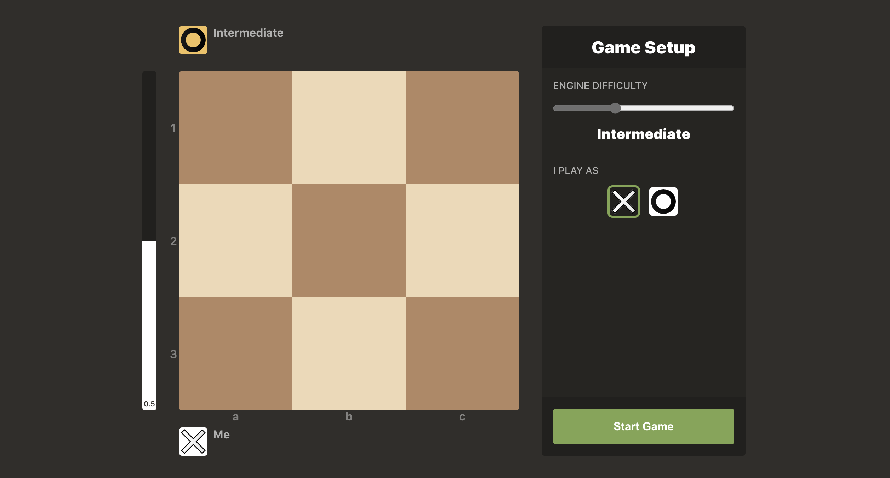

<h1 align="center">Tic-Tac-Toe Engine</h1>

*Finally, the chess.com of Tic-Tac-Toe. Users can play against multiple engine difficulties while receiving real-time move analysis, position evaluation, and suggestions.*


### [Try it out here!](https://mhollingshead.github.io/30-days-30-projects/6-tic-tac-toe-engine/build/)

### Tech Stack

*  JavaScript
*  React
*  Sass
* [chart.js](https://www.chartjs.org/)

Because this app has a *ton* of components, state, and state-based rendering I've chosen to go with React for the project framework. 

## Install and Run

1. Download / navigate to the `/6-tic-tac-toe-engine` directory.
2. Run `npm i` to install the necessary dependencies.
3. Run `npm start`. 

A new browser window should open to [http://localhost:3000](http://localhost:3000), where you should be able to start using the app.

## UI

The styling and color-palette of the UI is based mainly on [chess.com](https://www.chess.com/). I'll give a quick overview of some of the important UI components:

## Game Setup



When starting a new game, you have a few options:

### Engine Difficulty

The Engine Difficulty is the difficulty of the computer opponent you will be playing. Each difficulty corresponds to a certain max depth that the engine will use when looking for moves. The difficulties are as follows:

* **Beginner** (Depth 1)
  * Makes many mistakes
* **Intermediate** (Depth 3)
  * Makes some mistakes early-game and few mistakes late-game
* **Advanced** (Depth 5)
  * Makes very few mistakes early-game and no mistakes late-game
* **Expert** (Infinite Depth)
  * Makes no mistakes. Can only win or draw.

### I Play As

This option determines which pieces you'll play with: **X**s or **O**s. Xs will always go first.

## Gameplay


As you play a game, there are a few components that may be of interest:

### Evaluation Bar

The left-most component is the evaluation bar, which shows the evaluation of the current position relative to the human player. The human player's position is represented by the **white** portion of the bar while the computer's position is represented by the **black** portion of the bar.

The height of the human player's position can range from **0%** (completely losing) to **100%** (completely winning). A height of **50%** represents an even position.

On either side of the evaluation bar, you can see the **score abbreviation**, which will be one of the following values:

* **0.5** (The position is even)
* **W`n`** (This player can win in `n` turns)
* **1-0** (Human wins)
* **0-1** (Engine wins)

### Gameboard

The gameboard is a standard 3x3 board. If it's your turn, you can click a square to place your piece. Otherwise, the computer will make their move. You can tell which move was made last by looking for the square with the **yellow tint**.

### Arc Graph

The first component in the body of the sidebar is the Game Arc Graph, which indicates how the positions have shifted throughout the entire game. 

Sections above the midpoint of the graph (with a white fill) indicate favorable positions for the human player, while the sections below the midpoint of the graph (with a black fill) indicate favorable positions for the computer player.

### Move List

As moves are made, they will appear within the Move List, which is located below the Arc Graph within the sidebar. Each move in the move list has several components:

#### The Move Number

Which turn the move was made.

#### The Move

What move was made. Moves are formatted **piece-first** followed by the **coordinates** that represent the square that the piece was placed on.

For example, **Xc2** indicates that an **X** was placed on square **c2** (column 3, row 2).

#### The Move Rating

The score that the engine gave the move (using infinite depth). Scores can range from **-99** (losing) to **+99** (winning), with **0** being indifferent. X moves have white backgrounds while O moves have black backgrounds.

#### The Classification Icon

When a move is rated, it is classified relative to the other possible moves. The icons on the right indicate which classification the move falls under. These classifications and their meanings are as follows:

| Icon | Classification | Meaning |
| --- | --- | --- |
|  | **Best Move** | This move was the best possible move (or is among the best possible moves) |
|  | **Excellent Move** | This move is a great move but a better move exists |
|  | **Good Move** | This move is okay, there are better moves. This could also mean there may not be a better move available, but it is still not a great move. |
|  | **Inaccuracy** | An opportunity was missed to improve your position |
|  | **Mistake** | This move actively worsened your position |

**Inaccuracy** and **Mistake** classifications will list the best possible move to the right of the classification.

### Hint Button

If it's currently your turn to make a move, clicking the hint button will display the best possible moves given the current position. These moves will have a **green tint**.

## Engine

The engine uses the **minimax** algorithm to recursively check game branches, keeping track of the best score for each available move. It's adapted from a similar implementation found in [this repo](https://github.com/alialaa/tic-tac-toe-js-2020). First, we create a `Board` class, which represents the gameboard.

```javascript
class Board {
    constructor(state) {
        this.state = state;
    }
}
```

The `state` of the board is represented by an array of strings. Each index of the array contains either an `x`, `o`, or `-` (indicating an empty square). We supply the `Board` class with some methods like `isEmpty`, `isFull`, `insert`, and `getAvailableMoves` (I won't show these, since they're pretty standard). 

Lastly, we need a method to check for a winner:

```javascript
isTerminal() {
    // If the board is empty, it is not terminal
    if (this.isEmpty()) return false;
    // Loop through each possible win combination
    const winCombos = [[0,1,2],[3,4,5],[6,7,8],[0,3,6],[1,4,7],[2,5,8],[0,4,8],[6,4,2]];
    for (let i = 0; i < winCombos.length; i++) {
        // Check to see if x satisfies the current win condition
        const xWin = winCombos[i].reduce((acc, ind) => acc && this.state[ind] === 'x', true);
        // If so, return 'x' and the combination that won
        if (xWin) return { winner: 'x', squares: winCombos[i] };
        // Check to see if o satisfies the current win condition
        const oWin = winCombos[i].reduce((acc, ind) => acc && this.state[ind] === 'o', true);
        // If so, return 'o' and the combination that won
        if (oWin) return { winner: 'o', squares: winCombos[i] };
    }
    // If the board is full and no winner is found, the game ends in a draw
    if (this.isFull()) return { winner: 'draw' };
    // Otherwise, the board is not terminal
    return false;
}
```

This method should return `false` if the game has not finished, otherwise it will return a `winner` object. Next we define a class to represent a `Player`:

```javascript
class Player {
    constructor(maxDepth = -1) {
        this.maxDepth = maxDepth;
        this.scoreMap = new Map();
    }
}
```

We supply the `Player` class with `maxDepth`, which represents how many moves into the future the engine will look when scoring moves. The lower the `maxDepth`, the easier the opponent will be. By default, `maxDepth` is `-1`, meaning the engine will check all possible combinations of moves.

Finally, we add our minimax algorithm `getBestMove` as a method within `Player`:

```javascript
getBestMove(board, maximizing = true, depth = 0) {
    if (depth === 0) this.scoreMap.clear();
    // Check to see if the game has finished
    const gameFinished = board.isTerminal();
    if (gameFinished || depth === this.maxDepth) {
        // If the winner is the maximizing player, 
        // return 100 - depth (prioritize faster wins)
        if (gameFinished.winner === 'x') return 100 - depth;
        // If the winner is the minimizing player, 
        // return -100 + depth (prioritize faster wins)
        else if (gameFinished.winner === 'o') return -100 + depth;
        // Otherwise, return 0
        else return 0;
    }
    // Set best score to the minimum maximizing move score 
    // or the maximum minimizing move score
    let best = maximizing ? -100 : 100;
    // Search each available move given the current board state
    board.getAvailableMoves().forEach(index => {
        // Create a new board object
        const child = new Board([...board.state]);
        // Make the current move
        child.insert(maximizing ? 'x' : 'o', index);
        // Recursive call to get the best score of this move's game tree
        const nodeValue = this.getBestMove(child, !maximizing, depth + 1);
        // If the score is better than the current best score, update best
        best = maximizing ? Math.max(best, nodeValue) : Math.min(best, nodeValue);
        // If depth is 0 (i.e. our base call), 
        // set the node map for the score of this move
        if (depth === 0) {
            // If other moves already have this score, 
            // add the current move to the existing move array
            const moves = [...this.scoreMap.get(nodeValue) || [], index];
            this.scoreMap.set(nodeValue, moves);
        }
    });
    // If depth is 0 (i.e. our base call) return the best move
    if (depth === 0) {
        return this.scoreMap.get(best);
    // Otherwise, return the move that had the best score this round
    } else {
        return best;
    }
}
```

`getBestMove` is a recursive method that will return the best possible move given some `board` state and whether or not the player is the `maximizing` player. At the same time, it populates the `Player`'s `scoreMap`, mapping every possible move to a score (after searching `maxDepth` moves into the future). 

With these values, we have everything we need to make computer moves of varying difficulty, and to check human moves against the engine for scoring and position evaluation.

Given some board `state` and a `playerObject` (which contains the player's pieces as well as their difficulty, if any), we get an array of best possible moves with the following function: 

```javascript
const getMoves = (state, playerObject) => {
    // Create a new board
    const board = new Board(state.split(''));
    // Determine the engine depth based on difficulty
    let maxDepth = -1;
    if (playerObject.difficulty < 3) {
        // 1 for Beginner (0), 3 for Intermediate (1), 5 for Advanced (2), and -1 for Expert (3)
        maxDepth = playerObject.difficulty * 2 + 1;
    }
    // Create a new Player with the proper max depth
    const player = new Player(maxDepth);
    // Get the best move(s)
    return player.getBestMove(board, playerObject.pieces === 'x');
}
```

We can use `getMoves` any time we need a computer player to make a move. We'll also need a function that can rate a move given some board `state`, `piece` and `move`.

```javascript
const rateMove = (state, piece, move, playerPiece) => {
    // Create a new board using the state
    const board = new Board(state.split(''));
    // Normalize the move score depending on the piece
    const normalize = piece === 'x' ? 1 : -1;
    // Create a new Player
    const player = new Player(-1);
    // Get the best move. This creates the node map that scores every possible move
    const best = player.getBestMove(board, piece === 'x');
    // Convert the node map to an array of { score, moves } objects
    const moveMap = Array.from(player.scoreMap);
    const moves = moveMap.map(entry => ({ 
        score: Number(entry[0]) * normalize, 
        moves: entry[1] 
    // Sort from best to worst
    })).sort((a, b) => b.score - a.score);
    // Find the score for the move in question, then classify it
    for (let i = 0; i < moves.length; i++) {
        if (moves[i].moves.includes(move)) {
            // Scores range from -0.99 to 0.99
            const score = moves[i].score / 100;
            return { 
                // The score given by the engine
                score: score, 
                // The board position relative to the human player (0 min, 1 max)
                position: getPosition(score, piece, playerPiece),
                // The move "type", i.e. whether it was "BEST", "GOOD", "INACCURACY", "MISTAKE", etc.
                classification: getClassification(score, i),
                // The best move. If our move is one of several best moves, make sure we return ours
                best: i === 0 ? move : best[Math.floor(Math.random() * best.length)] 
            };
        }
    }
}
```

We do things similarly, but this time we search for the move within the `scoreMap`. We return a bunch of data related to the rating of the move, like the weighted score, the position relative to the human player, the classification, and the actual best move that may have been missed.

`getMoves` and `rateMove` are our two main engine functions. The rest of the functionality is handled by several state variables throughout our React components.