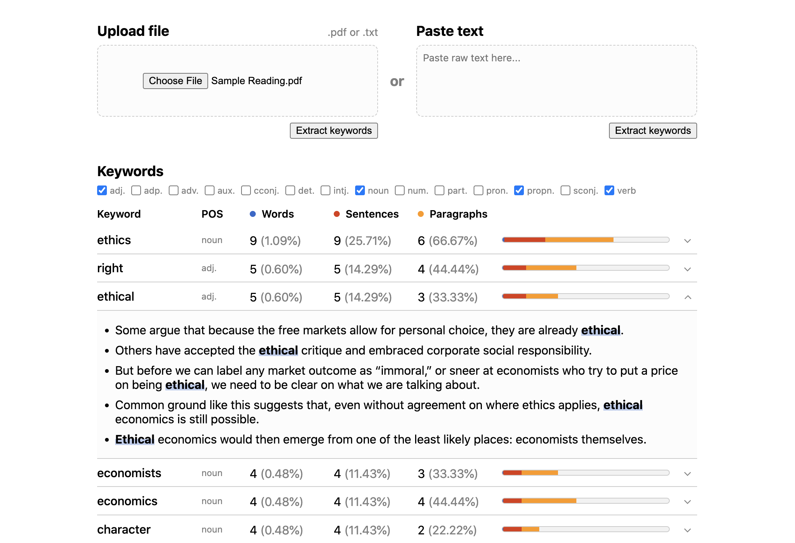

<h1 align="center">Keyword Extractor</h1>

*A webapp that analyzes prominent keywords within text. Users can upload .pdf and .txt files or paste text directly.*



### [Try it out here!](https://mhollingshead.github.io/30-days-30-projects/8-keyword-extractor)

### Tech Stack

*  JavaScript
*  HTML
*  CSS
* [PDF.js](https://mozilla.github.io/pdf.js/)
* [Tesseract.js](https://tesseract.projectnaptha.com/)
* [winkNLP](https://winkjs.org/wink-nlp/)

Though this app could have been implemented using a framework like React, I decided to keep it to the vanilla JavaScript/HTML/CSS stack to make the integration of the libraries as straightforward as possible.

### Implementation

The application's workflow is as follows:

#### 1. Receive input from the user

There are two different ways that users can upload documents: by **file upload** (.txt or .pdf) or by **pasting raw text**.

These are achieved via a file `input` or a `textarea`. Once the user submits one of the forms, we handle the inputs accordingly.

#### 2. Extract and subsection the text from the input

By the end of this step, we should end up with a `data` object that contains the document text subsectioned into **paragraphs**, **sentences**, and **words**. In most cases, we can divide the text into paragraphs by splitting it by newline characters `\n`. 

Dividing the text into sentences is less straightforward. At first glance, we could just split the text by punctuations `.`, `?`, or `!`, but there are cases where sentences contain punctuation in the middle of them (i.e. quotes containing sentences), or sentences don't contain any punctuation (like bullet points).

For these cases, we use [winkNLP](https://winkjs.org/wink-nlp/), a JavaScript library for Natural Language Processing. winkNLP is very good at determining when sentences end, plus it's able to determine other information like the part of speech of each word within the sentence.

winkNLP is intended to be used in Node.js. To use it in-browser, we'll need to write our functions in Node, then use [Browserify](https://browserify.org/) to bundle them with the necessary dependencies.

We create two functions that utilize winkNLP's Natural Language Processing: `subsection`, which takes a body of text and subsections it into sentences and POS-tagged words, and `getWords`, which splits some text into words only (filtering out punctuation and unnecessary characters):

```javascript
const winkNLP = require( 'wink-nlp' );
const model = require( 'wink-eng-lite-web-model' );
const nlp = winkNLP(model);
const its = nlp.its;

window.subsection = text => {
    const doc = nlp.readDoc(text);
    const sentences = doc.sentences().out();
    const tokens = doc.tokens().out(its.normal);
    const pos = doc.tokens().out(its.pos);
    const words = tokens.map((token, i) => ({ word: token, pos: pos[i] }));
    return { sentences, words };
};

window.getWords = text => {
    const doc = nlp.readDoc(text);
    return doc.tokens().out(its.normal);
}
```

We initialize these functions via the `window` object so that we can call them from the browser. 

Before we can subsection the text, we need to extract the text from the user's input of choice. If the user submitted **raw text** via the `textarea`, this step is as simple as obtaining the `value` of the element.

If the user submmitted a **.txt** file, we simply need to read the contents using a `FileReader`:

```javascript
const readFileAsText = file => {
    return new Promise((resolve, reject) => {
        const reader = new FileReader();
        reader.onload = () => resolve(reader.result);
        reader.onerror = () => reject(reader);
        reader.readAsText(file);
    });
}
```

Once we've received the text from the file reader, we subsection it and analyze the result:

```javascript
const readTxt = file => {
    // Read the .txt file
    readFileAsText(file).then(text => {
        // Split the text by paragraph
        const paragraphs = text.split('\n').filter(p => p.trim() !== '');
        // Create the data object, adding the further-subsectioned text
        const data = {
            text: text,
            paragraphs: paragraphs,
            ...subsection(text)
        }
        // Analyze the keywords
        analyzeKeywords(data);
    });
}
```

We use the same method above to create the `data` object for text inputted via the `textarea`, just without the `FileReader` step.

If the user uploaded a **.pdf** file, obtaining the text is much more complicated. Because we can't obtain the text directly from the file, we need to use PDF.js to render it in a `canvas` element, then send the `canvas` to an OCR to extract the text from the image.

First, we read the PDF file as data URL using a `FileReader`:

```javascript
const readFileAsDataURL = file => {
    return new Promise((resolve, reject) => {
        const reader = new FileReader();
        reader.onload = () => resolve(reader.result);
        reader.onerror = () => reject(reader);
        reader.readAsDataURL(file);
    });
};
```

Next, we use PDF.js to render the PDF on a canvas page by page. Each page, we'll call `Tesseract.recognize(canvas)` to extract the text content from the page:

```javascript
const pdfWorkerPath = 'js/pdf/pdf.worker.min.js';
const pixelRatio = window.devicePixelRatio * 2;
let canvas;

const readPdf = file => {
    // Read the file as a data URL
    readFileAsDataURL(file).then(pdfURL => {
        // Set the pdfjs worker source
        pdfjsLib.GlobalWorkerOptions.workerSrc = pdfWorkerPath;
        // Wrap the pdf rendering and ocr text recognition in an async function
        (async () => {
            // Initialize the pdf with pdfjs using the data URL
            const pdf = await pdfjsLib.getDocument({ url: pdfURL }).promise;
            // Get the total number of pages and update the progress bar
            const pages = pdf.numPages;
            // Initialize our data object to store the text, paragraphs, sentences, and words
            const data = { text: '', paragraphs: [] };
            // Loop through each page of the pdf
            for (let i = 1; i <= pages; i++) {
                // Get the current page of the pdf
                const page = await pdf.getPage(i);
                // Get viewport width / height information to prepare the canvas
                const viewport = page.getViewport({ scale: 1 });
                const width = viewport.width;
                const height = viewport.height;
                canvas.width = width * pixelRatio;
                canvas.height = height * pixelRatio;
                canvas.style.width = `${width}px`;
                canvas.style.height = `${height}px`;
                const ctx = canvas.getContext('2d');
                ctx.scale(pixelRatio, pixelRatio);
                // Render the current page of the pdf in the canvas element
                const renderContext = { canvasContext: ctx, viewport: viewport };
                await page.render(renderContext).promise;
                // Send the canvas to tesseract.js to recognize the text
                const result = await Tesseract.recognize(canvas);
                // Format the paragraphs returned by the ocr
                const paragraphs = result.paragraphs.map(p => {
                    return p.text
                        // If any paragraphs contain double newlines, they most-likely contain
                        // multiple paragraphs, so temporarily replace it with a unique string
                        .replaceAll('\n\n', '<p-break>')
                        // Replace the single line-breaks with spaces, as they are most-likely
                        // caused by wordwrap in the document
                        .replaceAll('\n', ' ')
                        // Replace the unique string with a linebreak
                        .replaceAll('<p-break>', '\n')
                });
                // Add the paragraphs to the total text
                data.text += paragraphs.join('\n');
                // Push the paragraphs to the paragraph array
                data.paragraphs.push(...paragraphs);
            }
            // Use winkNLP to subsection the text into sentences and words / their pos
            const { sentences, words } = subsection(data.text);
            // Add the subsectioned data to our data object
            data.sentences = sentences;
            data.words = words;
            // Analyze the keywords
            analyzeKeywords(data);
        })()
    });
};
```

The `readPdf` function is pretty long, but fairly straightforward when read line by line. The OCR provides us with the text divided into paragraphs. Sometimes this can be a little off, so we attempt to correct it by inserting `\n` characters manually. The OCR will also include `\n` characters within sentences and paragraphs because of how the text is organized on the document (e.g. wordwrap), so we replace these newlines with spaces. winkNLP will clean up the newlines and spaces when we subsection further.

Once we've read the text from all of the PDF's pages, we use our `subsection` function to obtain the sentences and words. Finally, we can analyze our keywords.

#### 3. Analyze the keywords

We analyze each keyword by doing the following:

* Count the number of times the word occurs within the text
* Count the number of sentences that contain the word
* Count the number of paragraphs that contain the word

Our `analyzeKeywords` function receives the different subsections of text. It reduces our `words` array to only unique words (usually this could be done using `Set`s, but because we're keeping track of each word's part of speech we do this manually). Then it goes through each sentence or paragraph, obtaining the words within them using our `getWords` function, checking to see if it includes the current word:

```javascript
let keywords;

const analyzeKeywords = ({ paragraphs, sentences, words }) => {
    // Create a dictionary for all unique words
    const uniqueWords = {};
    // Populate our word dictionary
    words.forEach(word => {
        // Keep track of all possible POS for each word
        if (uniqueWords[word.word] && !uniqueWords[word.word].pos.includes(word.pos)) {
            uniqueWords[word.word].pos.push(word.pos);
        } else {
            uniqueWords[word.word] = { word: word.word, pos: [word.pos] }
        }
    });
    // Generate the stats for each keyword
    const keywordData = Object.values(uniqueWords).map(({ word, pos }) => {
        // Count how many times the word is present in the text
        const wordsCount = words.reduce((acc, w) => acc + (w.word === word), 0);
        // Count how many paragraphs contain the word
        const paragraphsCount = paragraphs.reduce((acc, p) => acc + getWords(p).includes(word), 0);
        // Get the sentences that include the word
        const sentenceList = sentences.filter(s => getWords(s).includes(word));
        // Count how many sentences include the word
        const sentencesCount = sentenceList.length;
        // Return all relevant information
        return {
            word: word,
            pos: pos,
            words: { 
                count: wordsCount, 
                percent: wordsCount / words.length
            },
            paragraphs: { 
                count: paragraphsCount, 
                percent: paragraphsCount / paragraphs.length 
            },
            sentences: { 
                count: sentencesCount, 
                percent: sentencesCount / sentences.length, 
                list: sentenceList 
            }
        };
    });
    // Update the keyword list and render the keyword table
    keywords = keywordData;
    renderKeywords();
};
```

The reason we use `getWords(subsection).includes(word)` instead of `subsection.includes(word)` is to make sure we aren't overcounting. For example, assume we're checking for the occurance of the word `"of"`. If a sentence includes a word like `"official"`, `sentence.includes("of")` will return `true` (**of**ficial). To fix this, we use `Array.includes` on the array of words instead of `String.includes` on the entire string.

Once we've finished analyzing each word, we update the keywords array and render the keyword table, sorting from most occurances to least. When we render the table, we filter out any words that occur only once and apply any POS filters selected by the user.