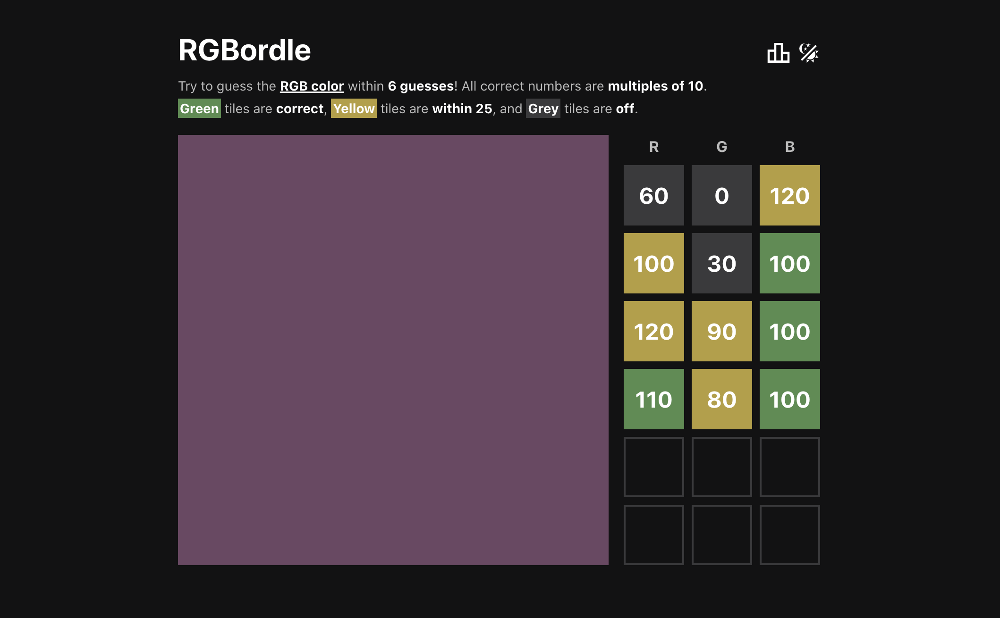
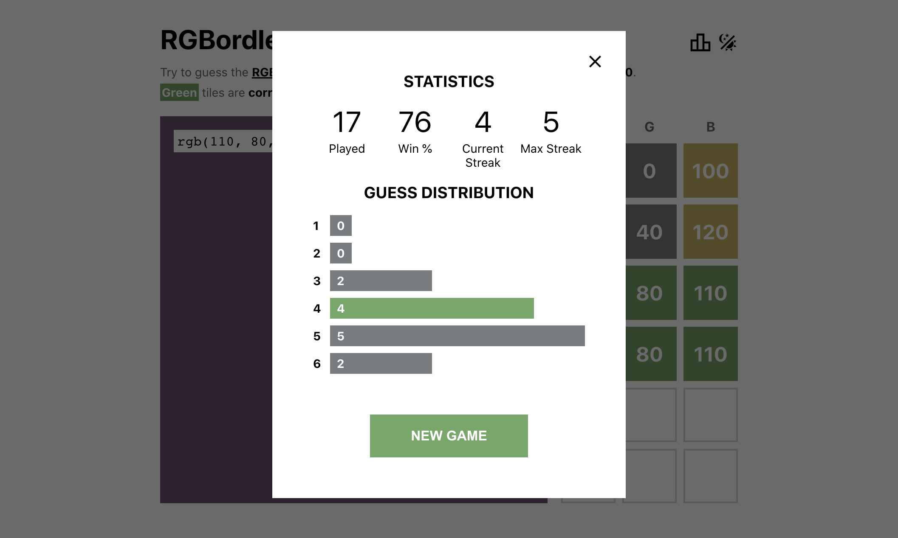

<h1 align="center">RGBordle</h1>

*A wordle-esque game where players try to guess RGB colors in 6 tries or less.*



### [Try it out here!](https://mhollingshead.github.io/30-days-30-projects/9-rgbordle/build/)

### Tech Stack

*  JavaScript
*  React
*  Sass

## Install and Run

1. Download / navigate to the `/9-rgbordle` directory.
2. Run `npm i` to install the necessary dependencies.
3. Run `npm start`. 

A new browser window should open to [http://localhost:3000](http://localhost:3000), where you should be able to start using the app.

## Implementation

Most of the functionality is similar to any other [wordle](https://www.nytimes.com/games/wordle/index.html) clone: an array of guesses are stored in state, and as the player makes guesses each tile is checked for accuracy and colored accordingly. The game ends when the user is either out of guesses or has a completely correct guess.

While I won't go through every single component, I'll point out some of the more interesting snippets.

### Generating the random color

In order for the game to work, we need to generate a random color that the player should try to guess. In this case, the color is just an `Array(3)` of integers from `0` to `250` that represent the `r`, `g`, and `b` components of an RGB color:

```javascript
const getRandomColor = () => {
    const r = Math.floor(Math.random() * 26) * 10;
    const g = Math.floor(Math.random() * 26) * 10;
    const b = Math.floor(Math.random() * 26) * 10;
    return [r, g, b];
};
```

The reason we max out at `250` rather than the actual maximum value `255` is because each of the 3 values are multiples of 10. That way, guessing the exact combination of `r`, `g`, and `b` values is actually doable in 6 guesses.

We have a `Color` component, which displays the color box to the left of the tiles. This component is in charge of generating the random color, and the way we display the color is somewhat interesting.

We don't want to just generate the color and set it as a `backgroundColor`, because it would be too easy for players to cheat by inspecting the element's styles. Instead, we do the following once the component has mounted:

1. Generate the random `[r, g, b]` array.
2. Create an `svg` string, setting its `fill` color to our randomly generated color.
3. Use the `DOMParser.parseFromString` method to parse the string as an `XMLDocument`.
4. Serialize the `XMLDocument` using the `XMLSerializer.serializeToString`.
5. Use `window.btoa` to `Base64`-encode our serialized string.
6. Finally, we prepend our `Base64` string with `data:image/svg+xml;base64,` and save it in state. That way, we can use an `` element to display the color by setting it's `src` attribute to the `Base64`-encoded string.

Player's aren't able to inspect elements and check the color without going through the trouble of decoding the image's `src`. Our `useEffect` hook looks like this:

```javascript
const [src, setSrc] = useState(null);

useEffect(() => {
    const randomColor = getRandomColor();
    // Create an SVG string with a the random color
    const svg = `<svg viewBox="0 0 80 80" xmlns="http://www.w3.org/2000/svg">
        <rect x="0" y="0" width="80" height="80" fill="rgb(${randomColor.join(',')})" />
    </svg>`;
    // Convert the SVG string to XML, then encode to base64 so that the color is not
    // obtainable by inspecting elements
    const xmlDoc = new DOMParser().parseFromString(svg, 'application/xml');
    const serializedXml = new XMLSerializer().serializeToString(xmlDoc);
    const encodedXml = window.btoa(serializedXml);
    // Update the src in state so we can use it for our  element
    setSrc('data:image/svg+xml;base64,' + encodedXml);
    // Send the random color to the game component
    setColor(randomColor);
}, []);
```

and we render like so:

```javascript
return (
    <div className='Color'>
        
    </div>
);
```

### Handling guesses

Guesses are submitted through a `form` using `input` elements of type `number` with `min` and `max` attributes set, so we don't have to check for validity other than ensuring all `input`s have a value.

We have 3 different cases for each guessed value:

1. The tile is **green** if the guessed value is equal to the corresponding answer value.
2. The tile is **yellow** if the guessed value is **within 25** of the corresponding answer value.
3. The tile is **grey** otherwise.

We send the three `r`, `g`, `b` values to a `makeGuess` function in our `Game` component. To check the guess and assign a color to each tile, we create an array `[r, g, b]` and loop through it, checking the conditions listed above:

* If `guess[i] === color[i]` then the guess is **green**.
* If `Math.abs(color[i] - guess[i]) <= 25` then the guess is **yellow**.
* Otherwise, the guess is **grey**.

Additionally, we keep track of how many correct values are in the current guess. Once we've determined the color of each tile, we can add the guess to our guess array, which will be rendered by the `Guesses` component.

Before setting our updated guess array in state, we check for any game over conditions, namely:

* `correctGuesses === 3`, or
* `currentGuess + 1 === 6`.

With 3 correct guesses we've guessed all 3 of the values, and if we've made 6 guesses then we've run out of guesses. If the game is over, we handle it accordingly in an `endGame` function.

```javascript
const makeGuess = (r, g, b) => {
    if (guessNumber === 6) return;
    // The array in state that stores all guesses
    const guessed = guesses;
    // A counter for the number of correct values this guess
    let numCorrect = 0;
    // Loop through each guessed value
    const guess = [r, g, b].map((value, i) => {
        // Tile color is grey by default
        let tile = 'grey';
        // If the guess is correct, the tile is green
        if (value == color[i]) {
            tile = 'green';
            // Increment our correct value counter
            numCorrect++;
        // If the guess is within 25, the tile is yellow
        } else if (Math.abs(value - color[i]) <= 25){
            tile = 'yellow';
        }
        // Return the guess and the tile color
         return { value, color: tile };
    });
    // Update our guess array
    guessed[guessNumber] = guess;
    // Check win conditions
    if (numCorrect === 3 || guessNumber + 1 === 6) {
        endGame(numCorrect === 3, guessNumber);
    }
    // Set our state values
    setGuesses(guessed);
    setCorrect(numCorrect);
    setGuessNumber(guessNumber + 1);
};
```

### Storing data

Some of the application data persists between sessions using `localStorage`. We store two values: `theme`, to keep track of whether the user prefers `dark` or `light`, and `stats`, to keep track of the users stats.



Once the `Game` component mounts, we grab the `stats` from `localStorage` and store them in state so that they can be sent to the `Stats` modal. On game end, we update the `stats` object like so:

```javascript
const endGame = (won, totalGuesses) => {
    // Increment total games played
    const games = stats.games + 1;
    // Increment wins if the game was won
    const wins = stats.wins + !!won;
    // Increment the streak if the game was won, otherwise set to 0
    const streak = won ? stats.streak + 1 : 0;
    // Update the max streak if necessary
    const maxStreak = Math.max(streak, stats.maxStreak);
    // Update the guess distribution if necessary
    const guessDistribution = stats.guessDistribution;
    if (won) guessDistribution[totalGuesses]++;
    // Update the stats in state
    setStats({ games, wins, streak, maxStreak, guessDistribution });
};

// Listen for changes to the stats in state and update localStorage
useEffect(() => {
    if (!stats) return;
    localStorage.setItem('rgb-stats', JSON.stringify(stats));
}, [stats]);
```