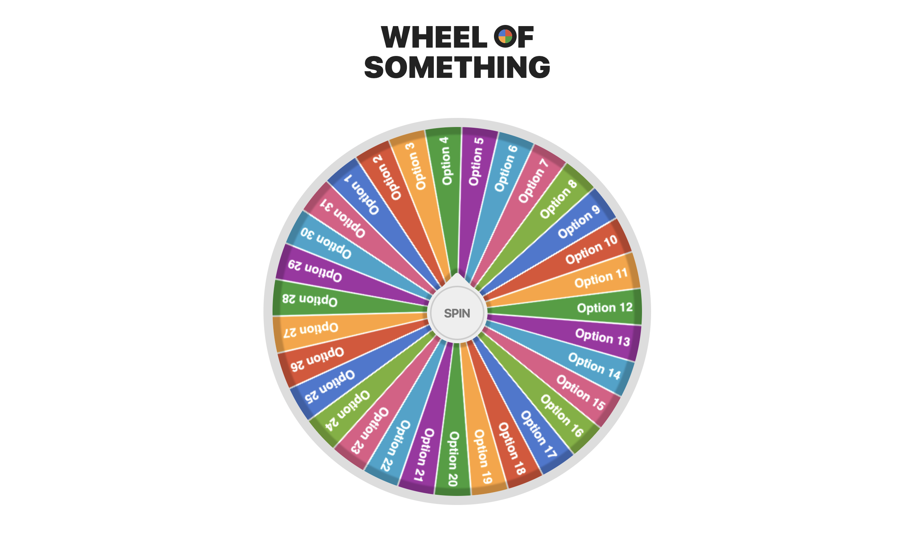

<h1 align="center">30 Days, 30 Projects</h1>

Today I challenged myself to create 30 projects in 30 days. Every day for the next month, I'll be building one web-development-related project from scratch and pushing them to this repo in order to track my progress and keep myself honest. Will I succeed? Will I fail? Will I survive? It's too early to tell. But as of right now I'm excited to get started. 

I've accumulated a little over 30 ideas in my "project-bank"––each one belonging to one of several categories:    or . I've tried to include a wide variety of project types and topics in hopes of exploring and working with many interesting technologies.

I'll include a brief overview of each project as I complete them below and provide a more detailed write-up in each individual project's directory.

<h2>Projects</h2>

### `Day 1` Wheel. Of. *Projects*. 

I'll start simple with a fun *"spin"* on a Random Number Generator: a Spin the Wheel app. The app takes a list of possible outcomes, puts them on a wheel, and can be spun to randomly select one outcome.

Going forward, each day I'll load the wheel with projects from my project-bank and spin it to determine which project I'll be working on.

**[Try it out here](https://mhollingshead.github.io/30-days-30-projects/1-wheel-of-something/)**, or check out the [detailed write-up](1-wheel-of-something).

#### Tech Stack

*  JavaScript
*  HTML
*  CSS
* [canvas-confetti](https://github.com/catdad/canvas-confetti)