<h1 align="center">30 Days, 30 Projects</h1>

Today I challenged myself to create 30 projects in 30 days. Every day for the next month, I'll be building one web-development-related project from scratch and pushing them to this repo in order to track my progress and keep myself honest. Will I succeed? Will I fail? Will I survive? It's too early to tell. But as of right now I'm excited to get started. 

I've accumulated a little over 30 ideas in my "project-bank"––each one belonging to one of several categories:   ,  or . I've tried to include a wide variety of project types and topics in hopes of exploring and working with many interesting technologies.

I'll include a brief overview of each project as I complete them below and provide a more detailed write-up in each individual project's directory.

<h2>Project Index</h2>

| Day | Project | Type | Tech Stack |
| --- | --- | --- | --- |
| 1 | [Wheel. Of. Something.](#day-1-wheel-of-projects-) |  |    |
| 2 | [tableme.js](#day-2-tablemejs-) |  |  |
| 3 | [BFS Pathfinding Visualization](#day-3-bfs-pathfinding-visualization-) |  |    |
| 4 | [Pixel Battle](#day-4-pixel-battle-) |  |    |
| 5 | [Equation Solver](#day-5-equation-solver-) |  |   |
| 6 | [Tic-Tac-Toe Engine](#day-6-tic-tac-toe-engine-) |  |    |
| 7 | [Weather Color](#day-7-weather-color-) |  |    |
| 8 | [Keyword Extractor](#day-8-keyword-extractor-) |  |    |
| 9 | [RGBordle](#day-9-rgbordle-) |  |    |
| 10 | [Theme Explorer](#day-10-theme-explorer-) |  |    |
| 11 | [Solar System Visualization](#day-11-solar-system-visualization-) |  |    |
| 12 | [My Timers](#day-12-my-timers-) |  |    |
| 13 | [Random Dictionary Domain](#day-13-random-dictionary-domain-) |  |   |
| 14 | [Hello, Match!](#day-14-hello-match-) |  |    |
| 15 | [GitHub LaTeX](#day-15-github-latex-) |  |   |
| 16 | [Type a Book](#day-16-type-a-book-) |  |    |

<h2>Projects</h2>

### `Day 1` Wheel. Of. *Projects*. 

I'll start simple with a fun *"spin"* on a Random Number Generator: a Spin the Wheel app. The app takes a list of possible outcomes, puts them on a wheel, and can be spun to randomly select one outcome.

Going forward, each day I'll load the wheel with projects from my project-bank and spin it to determine which project I'll be working on.

**[Try it out here](https://mhollingshead.github.io/30-days-30-projects/1-wheel-of-something/)**, or check out the [detailed write-up](1-wheel-of-something).

#### Tech Stack

*  JavaScript
*  HTML
*  CSS
* [canvas-confetti](https://github.com/catdad/canvas-confetti)

### `Day 2` tableme.js 

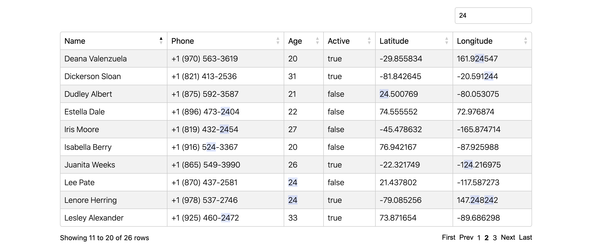

tableme.js is a simple JavaScript table library. It takes a JSON object array and renders a sortable, searchable, and paginatable table in the container of your choice. The components can be styled as desired, but a default theme is included.

**[Try it out here](https://mhollingshead.github.io/30-days-30-projects/2-tableme/)**, or check out the [documentation](2-tableme).

#### Tech Stack

*  JavaScript

### `Day 3` BFS Pathfinding Visualization 

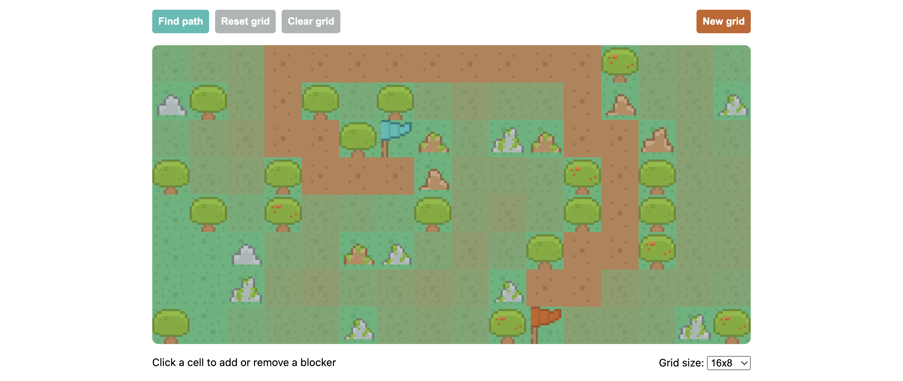

A simple Breadth-First Search algorithm implemented in JavaScript used to locate the shortest path between two points. Users can add and remove "blockers" (cells that the algorithm cannot traverse) and select from several grid dimensions.

**[Try it out here](https://mhollingshead.github.io/30-days-30-projects/3-pathfinding/)**, or check out the [detailed write-up](3-pathfinding).

#### Tech Stack

*  JavaScript
*  HTML
*  CSS

### `Day 4` Pixel Battle 

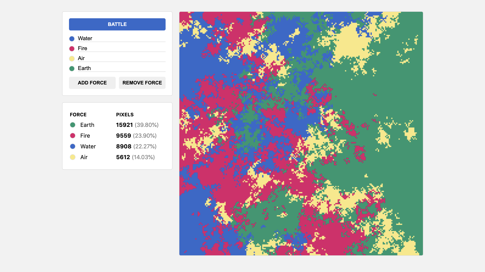

A simple webapp that simulates a pixel battle. Users can add up to 8 different "forces" and customize each one's color or name. Each force will fight to control the 200 x 200 pixel battlefield until only one is left standing.

**[Try it out here](https://mhollingshead.github.io/30-days-30-projects/4-pixel-battle/)**, or check out the [detailed write-up](4-pixel-battle).

#### Tech Stack

*  JavaScript
*  HTML
*  CSS

### `Day 5` Equation Solver 

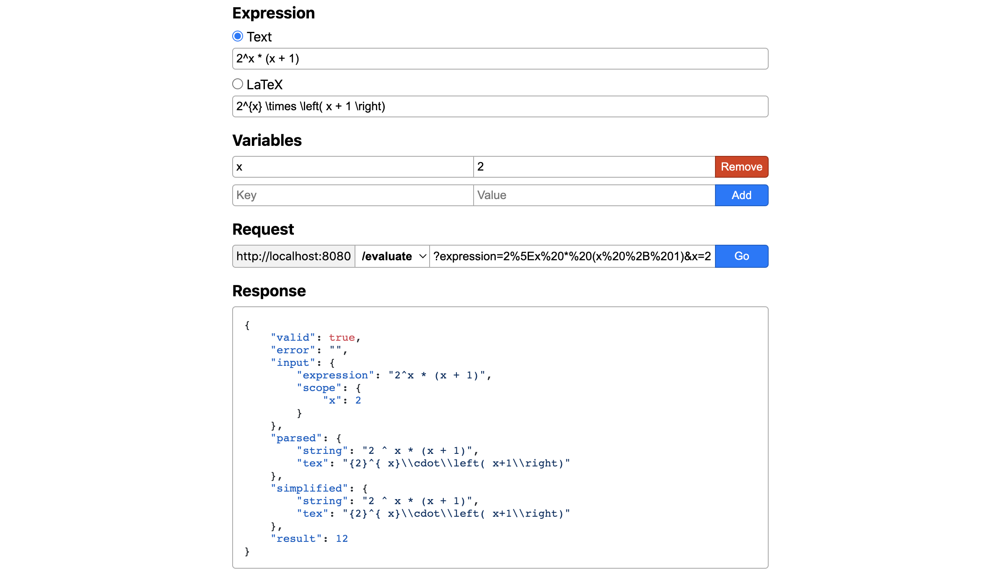

A REST API used to parse, simplify, or evaluate expressions. Expressions can be formatted as either plain text or LaTeX expressions.

**[Try it out here](https://mhollingshead.github.io/30-days-30-projects/5-equation-solver/demo/)**, or check out the [documentation](5-equation-solver).

### Tech Stack

*  Node.js
*  Express.js
* [math.js](https://mathjs.org/)

### `Day 6` Tic-Tac-Toe Engine 

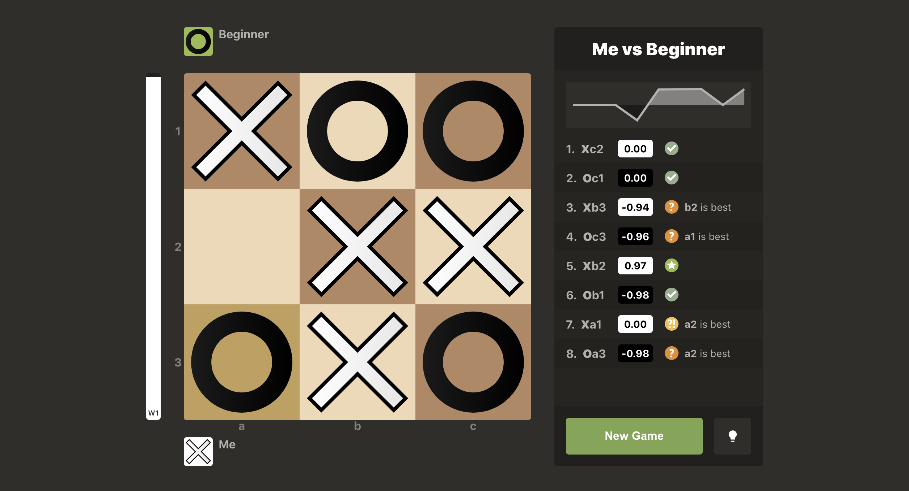

A Tic-Tac-Toe implementation where users can play against multiple engine difficulties while receiving real-time move analysis, position evaluation, and suggestions.

**[Try it out here](https://mhollingshead.github.io/30-days-30-projects/6-tic-tac-toe-engine/build/)**, or check out the [detailed write-up](6-tic-tac-toe-engine).

### Tech Stack

*  JavaScript
*  React
*  Sass
* [chart.js](https://www.chartjs.org/)

### `Day 7` Weather Color 

    

A single-page weather app that generates a gradient animation using the weather, temperature, and time of day in the user's current location.

**[Try it out here](https://mhollingshead.github.io/30-days-30-projects/7-weather-color)**, or check out the [detailed write-up](7-weather-color).

### Tech Stack

*  JavaScript
*  HTML
*  CSS
* [stripe-gradient.js](https://www.jqueryscript.net/animation/stripe-gradient-animation.html)
* [TinyColor](https://github.com/bgrins/TinyColor)
* [GeoJS](https://www.geojs.io/)
* [Open-Mateo](https://open-meteo.com/en)

### `Day 8` Keyword Extractor 

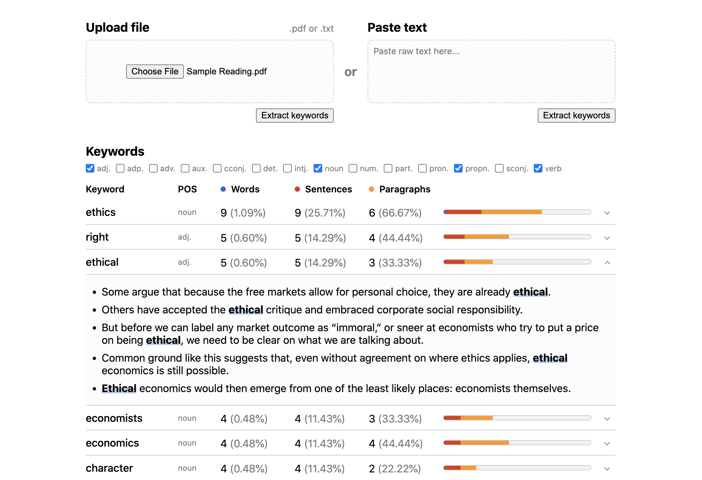

A webapp that analyzes prominent keywords within text. Users can upload .pdf and .txt files or paste text directly.

**[Try it out here](https://mhollingshead.github.io/30-days-30-projects/8-keyword-extractor)**, or check out the [detailed write-up](8-keyword-extractor).

### Tech Stack

*  JavaScript
*  HTML
*  CSS
* [PDF.js](https://mozilla.github.io/pdf.js/)
* [Tesseract.js](https://tesseract.projectnaptha.com/)
* [winkNLP](https://winkjs.org/wink-nlp/)

### `Day 9` RGBordle 

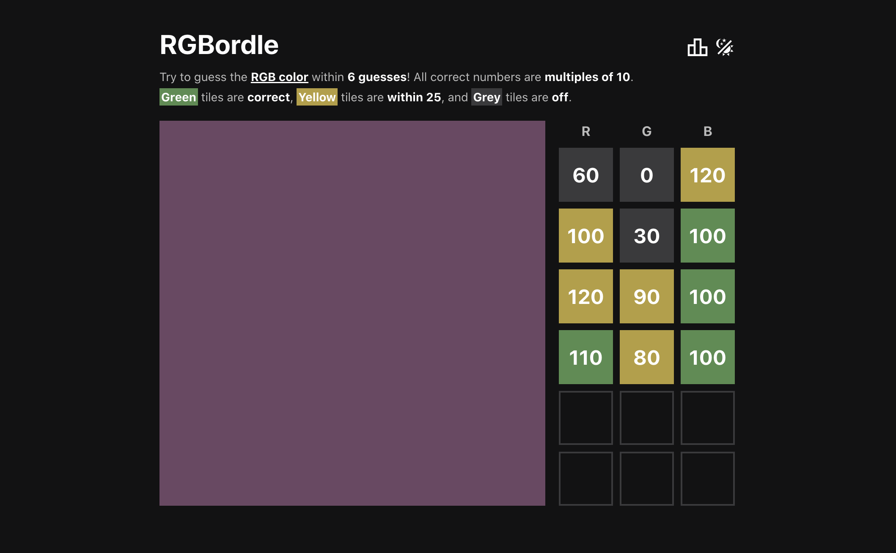

A wordle-esque game where players try to guess RGB colors in 6 tries or less.

**[Try it out here](https://mhollingshead.github.io/30-days-30-projects/9-rgbordle/build/)**, or check out the [detailed write-up](9-rgbordle).

### Tech Stack

*  JavaScript
*  React
*  Sass

### `Day 10` Theme Explorer 

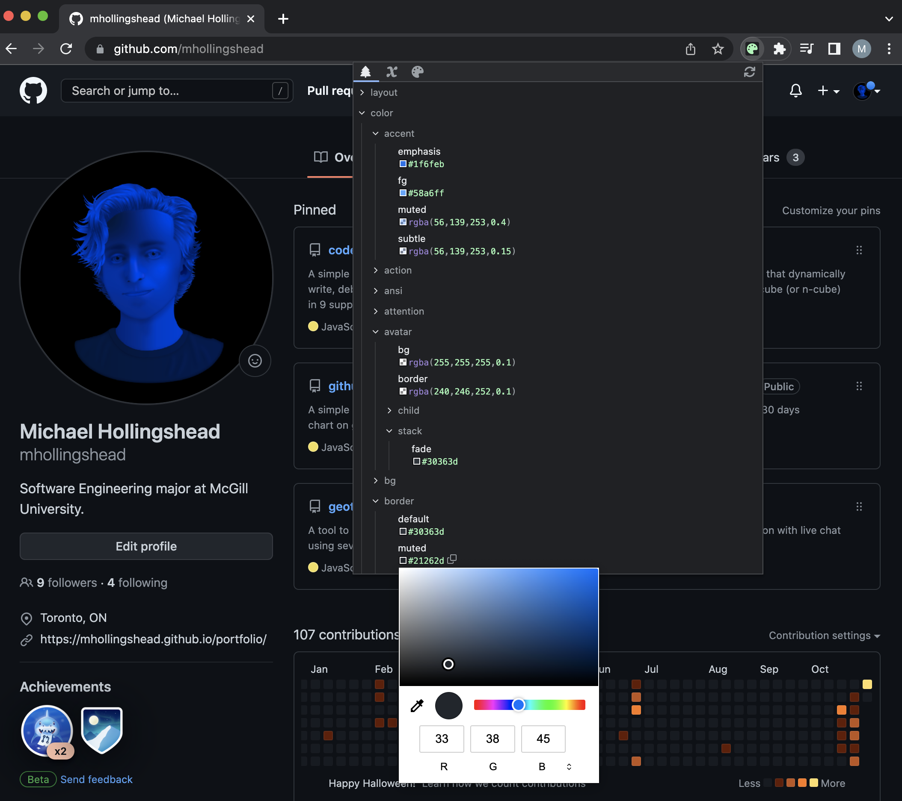

A simple Chrome Extension that allows users to explore any webpage's theme styles. The extension grabs any CSS variables defined on the current page's `:root` and `body` and organizes them into several "views" to be explored by the user.

**[Check out the project page here](10-theme-explorer)** for installation and usage.

### Tech Stack

*  JavaScript
*  HTML
*  CSS
* [Prism.js](https://prismjs.com/)
* [TinyColor](https://github.com/bgrins/TinyColor)

### `Day 11` Solar System Visualization 

    

A true to scale visualization of our solar system using scrolling.

**[Try it out here](https://mhollingshead.github.io/30-days-30-projects/11-solar-system-visualization)**, or check out the [detailed write-up](11-solar-system-visualization).

### Tech Stack

*  JavaScript
*  HTML
*  CSS
* [Sweet Scroll](https://tsuyoshiwada.github.io/sweet-scroll/)

### `Day 12` My Timers 

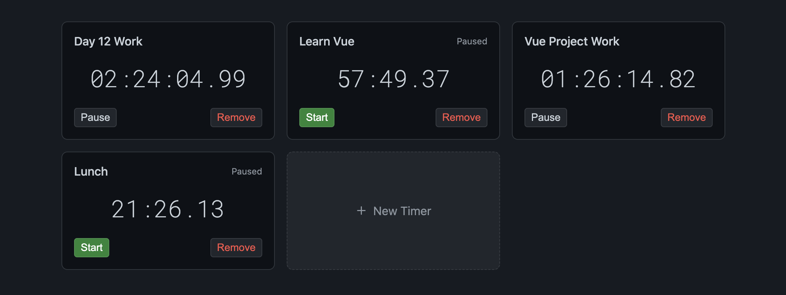

A time management app where users can add and remove timers. Both active and paused timers persist session to session using local storage.

**[Try it out here](https://mhollingshead.github.io/30-days-30-projects/12-my-timers/build)**, or check out the [detailed write-up](12-my-timers).

### Tech Stack

*  JavaScript
*  Vue.js
*  CSS

### `Day 13` Random Dictionary Domain 

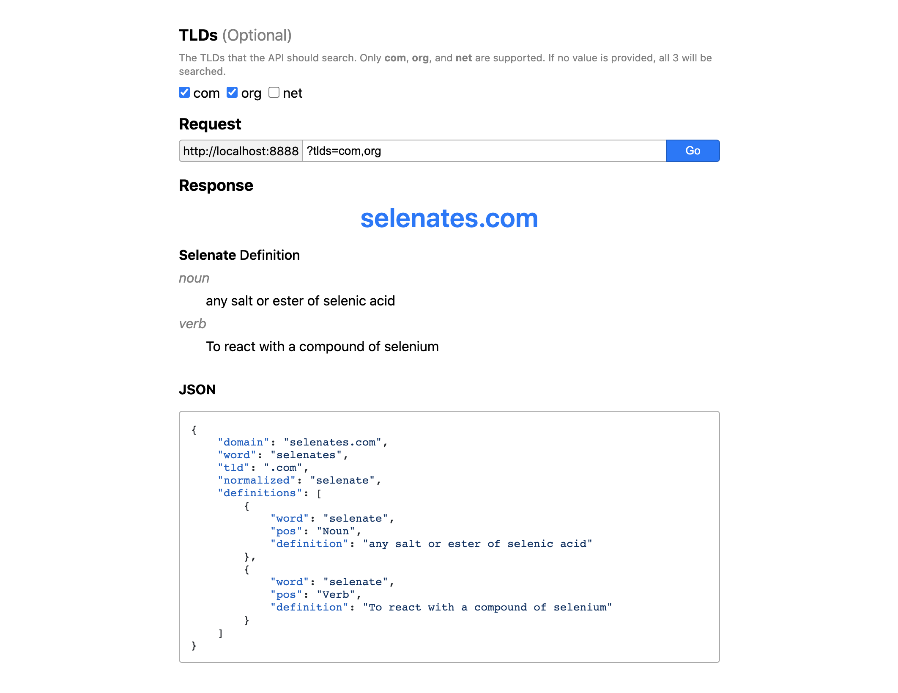

A simple REST API that attempts to find a random dictionary domain available for purchase.

**[Try it out here](https://mhollingshead.github.io/30-days-30-projects/13-random-dictionary-domain/demo/)**, or check out the [documentation](13-random-dictionary-domain).

### Tech Stack

*  Node.js
*  Express.js
* [Axios](https://axios-http.com/)
* [compromise](https://compromise.cool/)

### `Day 14` Hello, Match! 

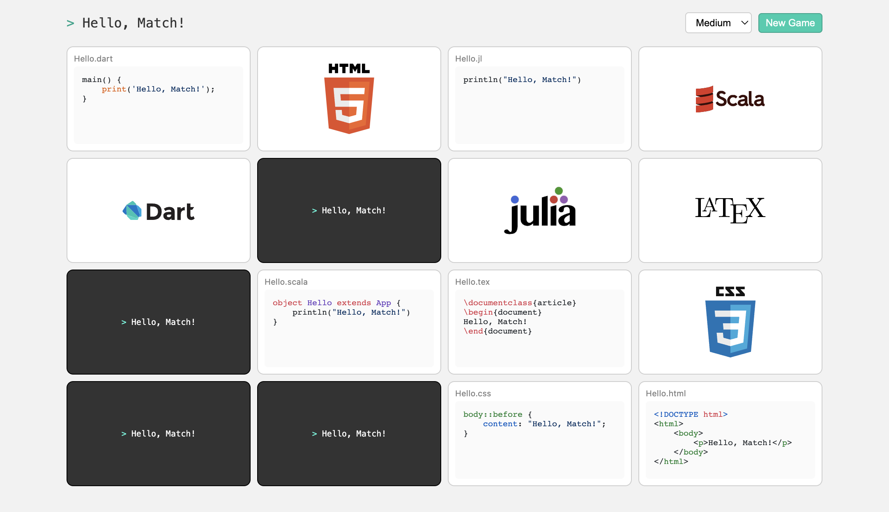

A simple card-flip memory game with a developer twist: match the programming language with the "Hello, World!" code!

**[Try it out here](https://mhollingshead.github.io/30-days-30-projects/14-hello-match/build)**, or check out the [detailed write-up](14-hello-match).

### Tech Stack

*  JavaScript
*  Vue.js
*  CSS
* [Highlight.js](https://highlightjs.org/)
* [canvas-confetti](https://www.kirilv.com/canvas-confetti/)

### `Day 15` GitHub LaTeX 

A simple API that allows you to embed inline LaTeX expressions like , or display expressions like

    

into GitHub READMEs, or any GitHub flavored markdown.

**[Check out the documentation here](15-github-latex)** for installation, usage, and examples.

### Tech Stack

*  Node.js
*  Express.js
* [Axios](https://axios-http.com/)

### `Day 16` Type a Book 

    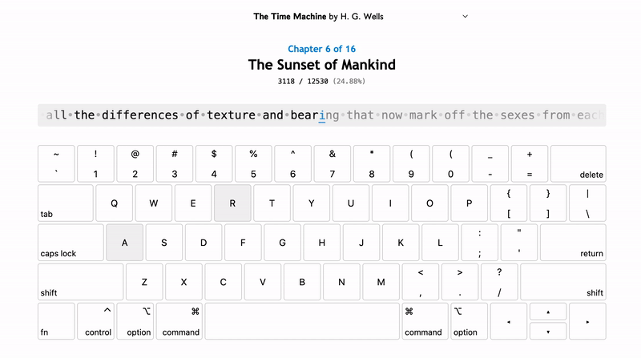

An app that allows users to practice typing while reading a classic novel.

This app started as a simple typing visualization, but as I was looking for bodies of text for the user to type I had the idea of using entire novels start to finish. In testing, I found that *typing* your way through a novel provides a really new and interesting way to experience a book.

**[Try it out here](https://mhollingshead.github.io/30-days-30-projects/16-type-a-book/build)**, or check out the [detailed write-up](16-type-a-book).

### Tech Stack

*  JavaScript
*  Vue.js
*  CSS